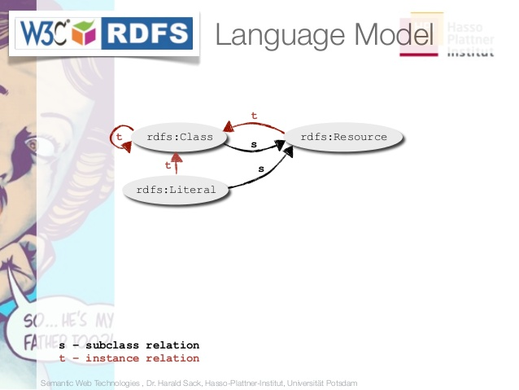

title: EDN6103
description: emchateau UdeM
name: inverse
layout: true

---

class: inverse, center, middle

# Web sémantique pour l’édition 

## (2ème demi journée)

#### EDN 6103 – Emmanuel Château-Dutier, Antoine Fauchié

---

class: inverse, center, middle

# Introduction

???

---

## Samedi 20 avril 2021, 9h-12h puis 13h-16h (Deuxième séance)

- Ontologies et vocabulaires structurés
- TP RDFs
- Quelles utilisations du web sémantique pour l’édition numérique ?
- Le protocole et le langage de requête SPARQL
- Notation SPARQL
- TP Écriture de requêtes SPARQL

#### Lectures

- RDF 1.1 Primer, W3C Working Group Note 24 June 2014, http://www.w3.org/TR/rdf11-primer/
- Bob Ducharme. « Jumping Right In: Some Data and Some Queries. » Learning  SPARQL. Querying and Updating with SPARQL 1.1. 2e édition. O’Reilly,  2013

---

# Sommaire

- ### [Ontologies et vocabulaires](#part5)

- ### [RDFs](#part6)

???


---

name: part5

class: inverse, center, middle

# Vocabulaires & Ontologies

???

### Notion de schéma, d’ontologie et de vocabulaires

Plusieurs standards définis par le W3C sont destinés à déclarer des classes, des propriétés.

exemple avec mied.org ??

### Comment ne pas être ambigu dans la description ?

En utilisant un langage commun d’interprétation de cette description

en employant des vocabulaires partagés

et des ontologies qui donnent une signification non-équivoque aux verbes, catégories de sujets et compléments.

Chaque ontologie peut être envisagée comme une manière particulière d’envisager un domaine. Un point de vue sur un domaine. cf. Gruber

Les ontologies peuvent être alignées, partagées et connectées pour produire ces points de vue (interopérabilité)

### Sur les vocabulaires

http://www.slideshare.net/valexiev1/gvp-lodcidocshort

http://www.slideshare.net/mzeng/aat-microthesauri

### Outils

[Skos play](http://labs.sparna.fr/skos-play/)

[Ginko](http://www.culturecommunication.gouv.fr/Divers/Harmonisation-des-donnees-culturelles/Referentiels/Les-vocabulaires-scientifiques-et-techniques/L-application-GINCO)

[OpenTheso](https://github.com/miledrousset/opentheso)

Le mot "ontologie" est compris ici comme un synonyme de "conceptualisation" (Gruber 1993) et en opposition à la signification du terme en philosophie qui est la science de ce qui est.

> A ontology is an explicit, formal specification of a shared conceptualization. (Thomas R. Gruber, 1993)
>
> […] ontologies are defined as a formal specification of a shared conceptualization. (Borst 1997)
>
> […] an ontology is a formal, explicit specification of a shared conceptualization.
> Conceptualization refers to an abstract model of some phenomenon in the world by having identified the relevant concepts of that phenomenon.
> Explicit means that the type of concepts used, and the constraints on their use are explicitly defined.
> Formal refers to the fact that the ontology should be machine readable.
> Shared reflects the notion that an ontology captures consensual knowledge, that is, it is not private of some individual but accepted by a group. (Studer 1998)

- langage commun (symboles, expressions) —> syntaxe
- signification des symboles et expressions claires —> sémantiques
- les symboles et expressions de sémantique similaire sont groupés en classes —> conceptualisation
- les concepts sont organisés de manière hiérarchique —> taxonomie
- du savoir implicite peut être rendu explicite —> raisonnement

Conceptuatlisation : modèle abstrait du domaine et ses expressions en rapport

Spécification : relative à un domaine

Explicite : la sémantique de toutes les expressions est claire

Formelle : lisible par la machine

Shared : consensus dans une communauté

cf. https://fr.slideshare.net/UMR7324/therese-libourel-ontologiesshs20151109tours?qid=5b2c86c6-d0ec-4194-af1d-6ff9dc9a22b7&v=&b=&from_search=9

Les ontologies qui peuvent être définies au moyen des standards RDF schéma (RDFs) et du Web Ontologie Language (OWL), contiennent à la fois des définitions informelles sous la forme de documentation pour les humains et de documentation formelles sous la forme de règles et de contraintes qui permettent de détecter des inconsistances ou de dériver de nouveaux faits à partir d’assertions.

Une ontologie peut par exemple définir des classes pour des livres des peintures, des tableaux et des personnes, une propriété d’auteur et déclarer formellement que toutes les ressources connectées aux livres par la propriété auteur front de type personne. Elle peut aussi formellement définir une autre classe d’objet comme une superclasse des livres et des peintures. En employant un moteur d’inférence sur les données de la collections de peinture et de livres, et en cherchant tous les objets créés par une personne, on pourra retrouver tous ces objets sans connaissance préalable de leur type spécifique, une fonctionnalité cruciale dès lors que l’intégration d’information est requise.

cf. Doerr, Martin, Stefan Gradmann, et Steffen Hennicke. 2010. The Europeana Data Model. In *IFLA 2010 (Gothenburg). Session on "Libraries and the Semantic Web".

Pour expliquer Ontologies

cf. https://fr.slideshare.net/SergeLinckels/semantic-web-ontologies

Classes

Instances

relations


Doerr, Martin. 2009. Ontologies for Cultural Heritage.* Handbook on Ontologies* p. 463-486. DOI : 10.1007/978-3-540-92673-3

Doerr, Martin, Stefan Gradmann, et Steffen Hennicke. 2010. The Europeana Data Model. In *IFLA 2010 (Gothenburg). Session on "Libraries and the Semantic Web"

Oldman, Dominci et CRM Labs. 2014. The CIDOC Conceptual Reference Model (CIDOC-CRM): PRIMER http://www.cidoc-crm.org/docs/CRMPrimer_v1.1.pdf

Juanals, Brigitte et Jean-Luc Minel. 2016. La construction d’un espace patrimonial partagé dans le Web de données ouvert.* Communication* 34 n° 1 p. doi :10.4000/communication.6650. https://communication.revues.org/6650.

Doerr, Martin. (2009). Ontologies for Cultural Heritage.* Handbook on Ontologies* p. 463-486. DOI : 10.1007/978-3-540-92673-3

---

## RDF Schema

- Premier brouillon du W3C en avril 1998
- Recommandation en février 2004

### RDF Schema définit .red[un modèle de données] pour la création de déclarations RDF.

### Le vocabulaire autorise

- la définition de **classes**
- l’**instantiation de classes** en RDF avec `rdf:type`
- la définition de **propriétés** et de **restrictions**
- la définition de **hiérarchies**
  - sous-classes et super-classes
  - sous-propriétés et super-propriétés

???

Quelque chose de bâti par dessus RDF.

Vous a toujours vendu l’idée que le web sémantique nous permettrait de faire des déductions, mais jusqu’ici on n’a pas fait grand chose. On a combiné des requêtes, etc. seules déduction qu’on ait faite interroger que si x marié a y, etc.

On a besoin de pouvoir intégrer un peu de sémantique, ce que l’on va pouvoir faire avec RDFs. On va pouvoir introduire des classes et des propriétés.

Représentation des connaissances en RDF

- Toute information est encodée comme un triplet
- un fait complexe est encodé comme une conjonction de triplets élémentaires
- on ne peut exprimer la négation ou la disjonction
- on peut déduire des nouvelles informations à l’aide d’un processus d’implication (*entailment*)

Exemple de typage, rappel utilisation des types XML Schema

### RDF Schema

- Premier brouillon du W3C en avril 1998
- Recommandation en février 2004

#### RDF Schema définit .red[un modèle de données] pour la création de déclarations RDF.

#### Le vocabulaire autorise

- la définition de **classes**
- l’**instantiation de classes** en RDF avec `rdf:type`
- la définition de **propriétés** et de **restrictions**
- la définition de **hiérarchies**
  - sous-classes et super-classes
  - sous-propriétés et super-propriétés

On peut aussi construire par dessus RDF un certain nombre de structures avec les *containers*. Ici reste dans RDF. Pour le moment, on se contentait de dire que l’on avait des rations entre a et b. Mais si veut dire que l’on a un cours et que des étudiants qui font partie de ce cours là, donc que ce cours là, c’est l’ensemble de ses étudiants. Comme il s’agit de cas de figure courants, on a défini en RDF des containers pour prendre en charge ces cas là.

Un type prédéfini destiné à exprimer le fait qu’on ait un ensemble d’étudiants. Ce qui dit que c’est un container, c’est que son type, l’URI de RDF bag.

http://www.w3c.org/1999/02/22-rdf-syntax-ns#Bag

en fait on a un nœud vide, et son type, le type prédéfini de bag.

Les éléments du bag sont codés à la suite en étant numérotés.

Pour accéder à tous les étudiants de ce bag, possibilité de faire des expressions régulière sur la valeur. Mais il existe ici un rdfs:member qui est un prédicat spécial interprété par l’interprète SPARQL.

Notation qui emploie des noms internes.

également les containers alt, collection, etc.

### RDFs types

RDF permet d’exprimer des énoncés simples à propos de ressources, de propriétés et de valeurs, mais il est nécessaire de pouvoir définir le vocabulaire utilisé dans ces énoncés —> RDFs

En RDF, toutes les ressources disposent d’un type (ou plusieurs) appelé classe. Ces classes peuvent être organisées en hiérarchies (classes, sous-classes).

- le type est une sorte ou classes de ressources
- les entités d’une même classe partagent des propriétés

e `rdf:type`, `rdfs:Class`, `rdfs:subClassOf`

### par ex. :

- Livre : auteur, titre, sujet...
- Personne : nom, prénom, titre, adresse, âge
- Entreprise : nom de société, nombre d’employés, adresse

---

## Vocabulaire RDFs, les .red[Classes]

#### `rdf:Class`
concept de classe, définit un objet abstrait qui est appliqué avec `rdf:type` pour créer des instances

#### `rdf:Property`
classe de base pour les propriétés

#### `rdfs:Resource`
toutes les entités du modèle RDF sont instances de cette classe

#### de plus

`rdf:Datatype`, `rdf:XMLLiteral`, `rdfs:Container`, `rdfs:ContainerMembershipProperty`.

---

## Classes de RDFs et RDF

#### Classes fondamentales

- `rdfs:Resource`
- `rdfs:Class`
- `rdfs:Literal, rdf:XMLLiteral`
- `rdfs:Property`
- `rdf:Statement`

#### Relations

- `rdf:type`
- `rdfs:subClassOf`
- `rdfs:subPropertyOf`

Type et liens entre les propriétés et des classes

#### Pour les propriétés

- `rdfs:domain` (dont les ressources peuvent être sujet)
- `rdfs:range` (dont les ressource peuvent être objet)

---

## Propriétés pour la réification  Statement, subject, prédicateur, object

#### Container

- `rdf:Bag`, `rdf:Seq`, `rdf:Alt`
- `rdf:List`, `rdf:first`, `rdf:rest`
- `rdfs:Container`, `rdfs:ContainerMembershipProperty`, `rdfs:member`

#### Autres propriétés auxiliaires (documentation pour les humains, pas de sémantique associée)

- `rdf:seeAlso` (lien vers une autre propriété qui l’expliqque
- `rdfs:isDefinedBy`
- `rdfs:comment`
- `rdfs:label`

---


---


---


---



---


---


---


---


---


???

https://www.w3.org/TR/rdf11-primer/

---

```rdf
@prefix rdfs: <http://www.w3.org/2000/01/rdf-schema#> .
@prefix ex: <http://www.example.org/schemas/vehicles#> .
@prefix rdf: <http://www.w3.org/1999/02/22-rdf-syntax-ns#> .
# Classes
ex:MotorVehicle rdf:type rdfs:Class .
ex:PassengerVehicle
	rdf:type rdfs:Class ;
    rdfs:subClassOf ex:MotorVehicle .
ex:Truck
      rdf:type rdfs:Class ;
      rdfs:subClassOf ex:MotorVehicle .
ex:Van
      rdf:type rdfs:Class ;
      rdfs:subClassOf ex:MotorVehicle .
ex:MiniVan
      rdf:type rdfs:Class ;
      rdfs:subClassOf ex:PassengerVehicle , ex:Van .
```

---

## Propriétés associant les classes

### .red[rdfs:domain] : propriété qui s’applique à une classe de ressource

- absent: toute ressource peut utiliser cette propriété
- 1 fois : s’applique aux instances de cette classe
- plusieurs fois : s’applique à des instances de toutes ces classes à la fois

### .red[rdfs:range] : classe des valeurs possibles

- absent: aucune restriction
- 1 fois: doit être instance de ce type
- plusieurs fois: instance de **toutes** ces classes

---

```rdf
ex:Person
	rdf:type rdfs:Class .
<http://www.w3.org/2001/XMLSchema#integer>
	rdf:type rdfs:DataType .
ex:registeredTo
	rdf:type rdf:Property ;
    rdfs:domain ex:MotorVehicle ;
	rdfs:range ex:Person .
ex:rearSeatLegRoom
	rdf:type rdf:Property ;
	rdfs:domain ex:PassengerVehicle ;
	rdfs:range <http://www.w3.org/2001/XMLSchema#integer> .
ex:driver
      rdf:type rdf:Property ;
      rdfs:domain ex:MotorVehicle .
ex:primaryDriver
      rdf:type rdf:Property ;
      rdfs:subPropertyOf ex:driver .
# Instances
ex:johnSmithsCar
    rdf:type ex:PassengerVehicle ;
    ex:primaryDriver <http://www.example.org/staffid/85740> ;
    ex:rearSeatLegRoom "127"^^<xsd:integer> ;
	ex:registeredTo <http://www.example.org/staffid/85740> .
```

---


.footnote[http://www.iro.umontreal.ca/~lapalme/ForestInsteadOfTheTrees/HTML/ch07s01.html]

---

## TP RDFs

Téléchargez le fichier suivant `exercices/CBWC-RDF-S.ttl`

Modifier le fichier local pour y ajouter les informations du tableau suivant associées à des vins qui sont déjà dans le fichier mais sans autre information.

Il faut aussi indiquer que le rdf:type de ces éléments est cb:Wine.

| uri   | wc:C00871996       | wc:C00042101   | wc:C00043125             |
| ----- | ------------------ | -------------- | ------------------------ |
| nom   | Château Montguérêt | Riesling Hügel | Domaine de l’Île Margaux |
| prix  | 14.65              | 7.95           | 22.80                    |
| année | 2011               | 2002           | 2004                     |

Comment faudrait-il procéder pour

1. Lister les vins (noms, prix et année) en ordre croissant d’année.
2. Lister les vins (noms, prix et année) en ordre croissant de prix.
3. Indiquez les types pour les prix (xsd:decimal) et les années (xsd:gYear).
4. Lister les vins (noms, prix et année) en ordre croissant de prix.
5. Lister les vins (noms, prix et année) en ordre croissant de prix en n’affichant pas les indications de type.

Solutions SPARQL http://www.iro.umontreal.ca/~lapalme/ift6281/RDF/ExerciceRDF.pdf

---

Linked Open Vocabularies (LOV)

https://lov.linkeddata.es/dataset/lov/

---

## Schema.org

https://schema.org

> Schema.org is a collaborative, community activity with a mission to create, maintain, and promote schemas for structured data on the Internet, on web pages, in email messages, and beyond.

https://doremus-anr.github.io/schema-visualizer/

---

## Discussion

### .red[Quelles opportunités pour le domaine éditorial ?]

--

- Quelles conséquences sur le format livre ?

--

- Quelles sources de données pourraient être utiles ?

--

- Quels types d’applications possibles ?

---

## Biblio

- Bermès, Emmanuelle dir. (2013). *Le Web sémantique en bibliothèque*. « Bibliothèques ». Paris : Édition du Cercle de la Librairie. ISBN 9782765414179
- Eero Hyvönen (2012). *Publishing and Using Cultural Heritage Linked Data on the Semantic Web.* Synthesis Lectures on semantic web : Theory and technology. Morgan & Claypool publishers. ISBN 1608459985
- Van Holland Seth, Ruben Verborgh (2014). *Linked Data for Libraries, Archives and Museums, How to clean, link and publish your metadata.* Facet publishing. ISBN 9781783300389
- Juanals, Brigitte et Jean-Luc Minel. 2016. La construction d’un espace patrimonial partagé dans le Web de données ouvert.* Communication* 34 n° 1 p. doi :10.4000/communication.6650. https://communication.revues.org/6650.
- Doerr, Martin. (2009). Ontologies for Cultural Heritage. *Handbook on Ontologies.* p. 463-486. DOI : 10.1007/978-3-540-92673-3
- Schafer, Valérie éd. (2016). *Histories of the Internet and the Web.*. Dirigé par Alexandre Serres. Living books about history. http://www.livingbooksabouthistory.ch/en/book/histories-of-the-internet-and-the-web
- Chignard, Simon (2012). L’open data: comprendre l’ouverture des données publiques. Limoges : Fyp. Entreprendre. ISBN 9782916571706.

---

## Pour aller plus loin

- Allemang, Dean et Jim Hendler. *Semantic Web for the Working Ontologist. Effective modeling in RDFS and OWL.* 2e éd. Morgan Kaufmann, 2011. ISBN-10: 0123859654 http://www.workingontologist.org
- DuCharme Bob. *Learning SPARQL: Querying and Updating with SPARQL 1.1.* 2e éd. O’Reilly, 2013. ISBN-10: 1449371434
- Gandon, Fabien (2012). Le web sémantique: comment lier les données et les schémas sur le web. Paris : Dunod. InfoPro. Management des systèmes d’information. ISBN 9782100572946.
- Yu, Liyang. *A Developer’s Guide to the Semantic Web.* 2e éd. Springer. 2014. ISBN-10: 3662437953.
- Hitzler, Pascal, Markus Krötzsch, Sebastian Rudolph. *Foundations of Semantic Web Technologies.* CRC Press. 2009. ISBN-10: 142009050X

---

## Lectures muséo

- Juanals, Brigitte et Jean-Luc Minel. « La construction d’un espace patrimonial partagé dans le Web de données ouvert. » Communication vol. 34 n° 1. doi :10.4000/communication.6650. <https://communication.revues.org/6650>
- Szekely, Pedro, Craig A. Knoblock, Fengyu Yang, Eleanor E. Fink, Shubham Gupta, Rachel Allen, et Georgina Goodlander. Publishing the Data of the Smithsonian American Art Museum to the Linked Data Cloud. International Journal of Humanities and Arts Computing.vol. 8 n° supplement, 2014. 152-166. <https://doi.org/10.3366/ijhac.2014.0104>

---

## WTF sur Tweeter

- Antoine Isaac (Europeana, Europe) @antoine_isaac
- Patrick Murray-John @patrick_mj
- Antoine Courtin @seeksanusername
- Josée Plamondon @joplam
- ICOM.CIDOC @icomCIDOC
