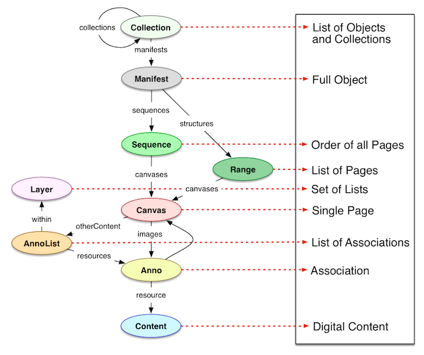
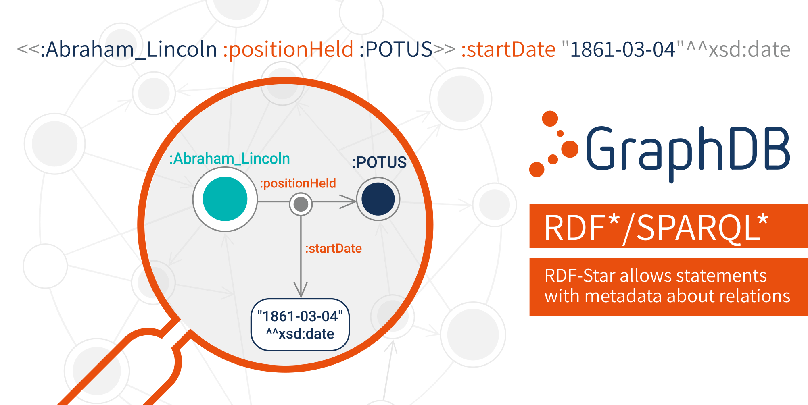

## EDN6103 - Web sémantique pour l'édition numérique

# SPARQL et Applications du LOD
Emmanuel Château-Dutier et Antoine Fauchié, mars 2021

Site web pour les ressources du cours :  
[https://publicarchi.github.io/edn6103/](https://publicarchi.github.io/edn6103/)

===↓===

# Sommaire

## 1. Écriture de requêtes SPARQL (suite)

## 2. Applications du Linked Open Data

## 3. Discussion

???

===→===

# 2. Écriture de requêtes SPARQL

???


===↓===

## Syntaxe SPARQL

La syntaxe SPARQL est basée sur la définition de modèles de triplets comportant des variables qui correspondent à des triplets de la base

#### Clause de résultat (*result clause*)

`SELECT`, `WHERE`, `CONSTRUCT`, `ASK`, `DESCRIBE`

#### Modèle de graphe (*query pattern*)

Précédé par la clause `WHERE`

- requêtes basées sur la notion de **modèles de graphe**
- des **variables** (identificateurs précédés de `?` ou `$`) sont instanciées lorsqu’un triplet concorde avec le modèle

#### Modificateurs de requête (*query modifiers*)

- Pour limiter, ordonner ou réarranger les résulats

===↓===

## Structure d’une requête SPARQL

```SPARQL
# prefix declarations
PREFIX foo: <http://example.com/resources/>
...
# dataset definition
FROM ...
# result clause
SELECT ...
# query pattern
WHERE {
    ...
}
# query modifiers
ORDER BY ...
```

???

Dans l’ordre, une requête SPARQL se compose des éléments (optionnels) suivants :

- Les **déclarations de préfixes** (*prefix declarations*), pour l’abbréviation des IRIs
- La **définition de jeu de données** (*dataset definition*), déclare le ou les graphes RDF requêtés
- Une **clause de résultats** (*result clause*), identifie quelle information retourner pour la requête
- Le **modèle de graphe** (*query pattern*), sépcifie ce qui doit être requêté dans le jeu de données
- Les **modificateurs de requêtes ou de résultats** (*query/solution modifiers*), pour limiter, sélectionner une partie des résultats, les ordonner ou les réarranger

(https://www.w3.org/2009/Talks/0615-qbe/)

===↓===

## Clause de résulat (result clause)

- #### **SELECT** – retourne une table liée (similaire à SQL)

- #### **ASK** – retourne vrai ou faux selon l’existence d’un *pattern* donné dans le graphe RDF

- #### **CONSTRUCT** – retourne un graphe RDF construit à partir des tables liées

- #### **DESCRIBE** – retourne un graphe RDF décrivant une ressource donnée

???

### Clause de résulat ou type de requête

Une requête débute par une clause qui peut comporter l’un des verbes suivants

- `SELECT *vars* WHERE *modèle*` qui retourne la liste des valeurs des variables pour lesquelles il existait des triplets dans la base qui concordaient avec le modèle de graphe.
- `CONSTRUCT *modèle1* WHERE *modèle2*` où les variables des deux modèles sont liées. Cette requête retourne une structure RDF qui regroupe les triplets de *modèle1* avec les valeurs des variables qui sont liées à des valeurs pour lesquelles il existait des triplets dans la base qui concordaient avec le *modèle2*.
- `ASK *modèle*` retourne `true` s’il existe au moins un triplet qui concorde avec le modèle et `false` sinon.
- `DESCRIBE` permet de *décrire* un ressource ou une variable mais cette description est laissée au soin de l’implantation.

===↓===

## Modèle de graphe

Les requêtes sont basées sur la notion de **modèle de graphe** qu’on cherche à retrouver dans une base de triplets. Dans un modèle de graphe, un triplet peut comporter des variables (i.e. des identificateurs précédés par `?` ou `$`) qui seront instanciées lorsqu’un triplet concorde au modèle en affectant une variable.

Un modèle de graphe est une suite de triplets entre accolades `{ }`. Une variable liée dans un triplet garde la même valeur dans tous les autres triplets où elle est utilisée dans le même modèle de graphe. Il est de plus possible d’ajouter des contraintes supplémentaires sur les triplets par un *filtre* qui peut apparaître entre des triplets dans un modèle de graphe. Par exemple, le modèle de graphe `{?s ex:p "o". ?s ex:p "o1"}` liera la variable `?s` à tous les sujets de la base de triplets qui ont comme prédicat `ex:p` et objet `"o"` et `"o1"`.

Comme on peut utiliser les notations abrégées de triplets, ce modèle de graphe aurait aussi pu s’écrire `{?s ex:p "o", "o1"}`.

???

### Modèle de graphe

SPARQL a une syntaxe basée sur la définition de modèles de triplets comportant des variables qui correspondent à des triplets de la base

- Les requêtes sont basées sur la notion de modèle de graphe qu’on cherchera à retrouver dans une base de triplets. 
- Dans un modèle de graphe, un triplet peut comporter des variables (i.e. des identificateurs précédés par `?` ou `$`) qui seront instanciées lorsqu’un triplet concorde au modèle en affectant une variable.

===↓===

### Exemple de modèle de graphe

```SPARQL
PREFIX purl:
```

???

@todo

===↓===

## Notation des variables et des modèles

- URI ou Littéral `?var ?une_autre_var $v`
- Nœuds vides `_:id []`

#### Patrons de triplets

- Match complet 	`ex:machin ex:numero "45692"`
- Match avec une variable 	`?machin ?ex:numero "?valeur`
- Match complet 	`ex:truc ?propriete ?valeur`

===↓===

## Autres fonctionnalités

- `ORDER BY`, `LIMIT`, `OFFSET` 

  pour limiter l’ensemble résultat comme dans SQL

- `FROM`, `FROM NAMED` 

  employés pour spécifier des graphes par défaut ou des graphes nommés pour la requête

- `SELECT DISTINCT` 

  retire les doublons du résultat

- `VALUES` 

  variables prédéfinie spécifiant liant dans la forme tabulaire

===↓===

## Modificateurs

- `ORDER BY *variables*`
- `DISTINCT`

Les triplets étant considérés comme un ensemble, il n’est pas possible de se fier à l’ordre d’apparition des résultats. Néanmoins, on peut modifier l’ordre de la sortie avec les mots-clefs suivants :

- `ORDER BY *variables*` à la fin de la requête, trie les solutions en ordre croissant des variables; pour l’ordre décroissant, on indique `DESC(*variable*)`. On peut trier les solutions sur plusieurs clés.
- `DISTINCT` à placer immédiatement après le *verbe* (i.e. le premier terme) d’une requête pour garantir que chaque solution n’apparaîtra qu’une fois.

### Autres possibilités

SPARQL 1.1 fournit également des fonctions d’agrégation telles des sommes ou des moyennes et la possibilité de définir des variables. 

Nous ne décrivons ici que les principaux éléments de la syntaxe SPARQL. Il est également possible d’interroger plusieurs graphes ou faire des requêtes fédérées. Pour la syntaxe complète, il convient de se référer à [la documentation du W3C](http://www.w3.org/TR/sparql11-query/).

===↓===

## Modèles de graphe (*graph patterns*)

- #### **conjonction** (séquence de motifs de graphes)

- #### **disjonction** (UNION pattern), équivalent de l’opérateur booléen OU

- #### **négation** (FILTER NOT EXISTS, MINUS)

- #### **conjonction conditionnelle** (OPTIONAL)

===↓===

### Graph Pattern (GP)

```SPARQL
# Basic Graph Pattern (BGP)
?x :p ?y .
?y :s _:a .
```

```SPARQL
# Group Graph Pattern (GGP)
{ ?x :p ?y . }
{ ?y :s _=a . }
```

```SPARQL
# Alternative Graph Pattern (AGP)
{ ?x :p1 ?y . }
UNION
{ ?x :p2 ?y . }	
```

```SPARQL
# Optional Graph Pattern (OGP)
?x :p ?y .
OPTIONAL { ?y :s _:a }
```

```SPARQL
# Patterns on Named Graph
```

===↓===

## Filtres

Syntaxe : `FILTER(boolean condition)`

La clause filtre les résultats de BGP, il peut être placé n’importe où dans un BGP.

`FILTER *expression*` où `*expression*` est composée d’une combinaison des éléments suivants :

- **conversion** entre une chaîne et un type XML en appelant une fonction du nom du type `xsd:integer` ou `xsd:dateTime` sur une chaîne, une variable ou une expression
- une expression arithmétique ou logique entre parenthèses; cette expression utilise les opérateurs infixes *habituels*
- un appel à une fonction prédéfinie, p. ex. `isIRi(?x)`, `isBLANK(?x)` ou `REGEX(*string*,*pattern*)`.

Un filtre s’applique au modèle de graphe entier où il se trouve, peu importe sa position dans le graphe.

???

Fonctions de chaînes : strlen, contains, substr, concat, regex, replace

Fonction de terme RDF : isIRI, IRI, isBlank, BNODE

BGP : Basic Graph Pattern

===↓===

### Exemple de filtres

```SPARQL
PREFIX dc: <http://purl.org/dc/elements/1.1/> 
SELECT ?title
WHERE { 
	?x dc:title ?title .
	?x dc:author ?author
	FILTER regex(?title, ".SPARQL") 
}
```

```SPARQL
PREFIX : <http://example.org/> 
PREFIX rdfs: <http://www.w3.org/2000/01/rdf-schema#> 
SELECT ?s ?l
WHERE {
	?s :invented ?i .
	?i rdfs:label ?l
	FILTER ( regex(?l,"ˆ.ul.*") && contains(str(?s),"Cimr") )
}
```

???

La clause `FILTER` utilise une condition booléenne pour filtrer les résultats non recherchés.

On peut associer deux expressions booléennes dans une parenthèse avec l’opérateur `&&`.

Il existe plusieurs fonctions et opérateurs de filtres prédéfinies

- *logique :* `!`, `&&`, `||`
- *arithmétique :* `+`, `-`, `*`, `/`
- *comparaison :* `=`, `!=`, `>`, `<`, ...
- *SPARQL tests:* `isURI`, `isBlank`, `isLiteral`, `bound`
- *SPARQL accessors:* `str`, `lang`, `datatype`
- *autres :* `sameTerm`, `langMatches`, `regex`

===↓===

## Optional

Syntaxe : GP1 OPTIONAL { GP2 }

Les résultats de GP1 sont augmentés optionnellement avec les résultats de GP2, s’il y en a.

```SPARQL
PREFIX : <http://example.org/> 
PREFIX rdfs: <http://www.w3.org/2000/01/rdf-schema#> 
SELECT ?s ?i ?l
WHERE {
	?s :invented ?i . 
	OPTIONAL {
		?i rdfs:label ?l FILTER (lang(?l)="en") . 
	} 
	OPTIONAL {
		?i rdfs:label ?l FILTER (lang(?l)="fr")
	}
}
```

`OPTIONAL` essaye de faire correspondre le graph à un autre motif optionnellement. Si un motif optionnel échoue, les variables restent non liées avec cette solution.

L’ordre des OPTIONALs peut parfois être important.

Tous les triplets s’électionnés peuvent ne pas avoir d’étiquette dans chacune des langues.

===↓===

## Alternatives

```SPARQL
PREFIX dcmi: <http://purl.org/dc/dcmitype/>
SELECT ?doc
WHERE { 
	{ ?doc a dcmi:Dataset . }
  UNION
	{ ?doc a dcmi:Image . }
}
```

 `UNION` forme une disjonction de deux motifs de graphe. Les solutions des deux côté de l’UNION sont inclues dans les résultats.

===↓===

## Négation

Deux constructions MINUS vs. FILTER NOT EXISTS

````SPARQL
PREFIX : <http://example.org/> 
PREFIX rdfs: <http://www.w3.org/2000/01/rdf-schema#
SELECT ?s1 ?i
{ ?s1 :invented ?i.
  MINUS {
   ?s2 :invented ?i .
   FILTER(?s1 != ?s2) . 
   }
}
````

```SPARQL
SELECT ?s1 ?i 
{ ?s1 :invented ?i.
  FILTER NOT EXISTS {
   ?s2 :invented ?i .
   FILTER(?s1 != ?s2). 
   }
}
```

???

Dans le premier cas la variable ?s1 n’est pas liée dans le motif MINUS, retourne tous les inventeurs.

Dans le second cas, retourne toutes les inventions qui furent inventées par seulement un inventeur.

===↓===

Find me members of the  Senate Armed Service committee’s Strategic Forces subcommittee who do  not also serve on the Personnel subcommittee.

```SPARQL
PREFIX foaf:  <http://xmlns.com/foaf/0.1/>
SELECT ?name 
WHERE {
  # find members in the Strategic Forces subcommittee
  <http://www.rdfabout.com/rdf/usgov/congress/committees/SenateArmedServices/StrategicForces> 
    foaf:member ?member .
  OPTIONAL {
    # find out if this same member is in the Personnel 
    # subcommittee - but call him/her something different 
    # (?member2)
    <http://www.rdfabout.com/rdf/usgov/congress/committees/SenateArmedServices/Personnel> 
      foaf:member ?member2 .
    FILTER (?member2 = ?member) .
  }
  # keep only those rows that failed to find a ?member2 
  # (member of Personnel subcommittee)
  FILTER (!bound(?member2)) .
  ?member foaf:name ?name .
}
```

???

- Together, `OPTIONAL` and the `!bound(...)` filter allow us to query for things that are *not* asserted in the RDF dataset.
- A similar technique allows for various types of universally quantified queries. (E.g. min or max value of a predicate.) See [this frequently asked question](http://thefigtrees.net/lee/sw/sparql-faq#universal).

Try it with [the GovTrack-specific SPARQL endpoint](http://www.govtrack.us/sparql.xpd). ([Expected results.](https://www.w3.org/2009/Talks/0615-qbe/#q13r))

https://www.w3.org/2009/Talks/0615-qbe/

===↓===

## Agrégations

- `COUNT(?var)`, ou `COUNT(DISTINCT ?var)`

  compte le nombre ou les occurence (distinctes) de `?var` dans l’ensemble résultat

- `MIN(?v)`, `MAX(?v)`, `SUM(?v)`, `AVG(?v)` 

  analogues à leur équivalents SQL

- `GROUP CONCAT(?var; separator = <SEP>) AS ?group)`

  concatène tous les elements dans le groupe avec le caractère séparateur donné

- `SAMPLE` 

  prend une représentant arbitraire dans le groupe

???

Usage of (?expr as ?var) alias is obligatory.

Similarly to SQL, SPARQL allows computing aggregates over particular
data groups and filter in them using GROUP BY/HAVING construct

===↓===

### Exemple d’agrégation

```SPARQL
PREFIX : <http://example.org/>
PREFIX rdfs: <http://www.w3.org/2000/01/rdf-schema#>
SELECT ?i COUNT(?s) AS ?count
FROM :inventors 
WHERE {
	?s :invented ?i. 
}
GROUP BY ?i
```

===↓===

### Exemple d’agrégation

```SPARQL
PREFIX : <http://example.org/>
PREFIX rdfs: <http://www.w3.org/2000/01/rdf-schema#>
SELECT (COUNT(?s) AS ?count) ?i (GROUP_CONCAT(?s;separator=",") AS
	?inventors) 
FROM :inventors 
WHERE {
	?s :invented ?i. 
}
GROUP BY ?i
HAVING (COUNT(?s) > 1)
```

(expr AS ?v) assignent de variable où expr est une expression et ?v la nouvelle variable créée

===↓===

# TP Écriture de requêtes SPARQL

???

Utilisation de http://yasgui.triply.cc/

http://epimorphics.github.io/qonsole

Utilisation dans [Twinkle](http://www.iro.umontreal.ca/~lapalme/ift6281/Twinkle.html) ?

Aide-Mémoire http://www.iro.umontreal.ca/~lapalme/ift6282/SparqlRappels.html

===↓===

### SPARQL par l’exemple 

(dans **YASGUI** sur http://data.persee.fr/sparql)

- Explorer l’ensemble des contenus
- Chercher les noms, prénoms et auteurs de tous les auteurs
- Supprimer les doublons
- Limiter aux 20 premiers résultats
- Trier par ordre alphabétique
- Chercher Bernard Lepetit
- Lister tous les triplets dont cet auteur est l’objet
- Lister ses publications
- compter par type, etc. group by

Aide-mémoire par Guy Lapalme http://www.iro.umontreal.ca/~lapalme/ift6282/SparqlRappels.html

===↓===

Explorer l’ensemble des contenus avec la requête

http://data.persee.fr/sparql

```SPARQL
SELECT * 
WHERE { ?subject ?predicate ?object }
LIMIT 100
```

```SPARQL
SELECT DISTINCT ?objet
WHERE {
  ?sujet a ?objet .
}
LIMIT 100
```

===↓===

## Lister les classes

Très souvent, quand on aborde un SPARQL endpoint, il peut être utile de visualiser les classes

```SPARQL
SELECT DISTINCT ?Concept 
WHERE {
  [] a ?Concept.
}
LIMIT 100
```

Exemple https://isidore.science/sqe

===↓===

Chercher les noms et prénoms de tous les auteurs

```SPARQL
PREFIX marcrel: <http://id.loc.gov/vocabulary/relators/>
PREFIX foaf: <http://xmlns.com/foaf/0.1/>
SELECT ?surname ?forename ?author
WHERE {
  ?doc marcrel:aut ?author .
  ?author foaf:familyName ?surname .
  ?author foaf:givenName ?forename .
}
```

===↓===

Ajouter un concat

```SPARQL
PREFIX marcrel: <http://id.loc.gov/vocabulary/relators/>
PREFIX foaf: <http://xmlns.com/foaf/0.1/>
SELECT concat(?surname, ' ', ?forename) ?author
WHERE {
  ?doc marcrel:aut ?author .
  ?author foaf:familyName ?surname .
  ?author foaf:givenName ?forename .
}
```

???

concat est une fonction qui prend plusieurs arguments séparés par des virgules 

===↓===

Ajouter un concat et une nouvelle valeur

```SPARQL
PREFIX marcrel: <http://id.loc.gov/vocabulary/relators/>
PREFIX foaf: <http://xmlns.com/foaf/0.1/>
SELECT concat(?surname, ' ', ?forename) AS ?nom ?author
WHERE {
  ?doc marcrel:aut ?author .
  ?author foaf:familyName ?surname .
  ?author foaf:givenName ?forename .
}
```

???

concat est une fonction qui prend plusieurs arguments séparés par des virgules

===↓===

Supprimer les doublons

```SPARQL
PREFIX marcrel: <http://id.loc.gov/vocabulary/relators/>
PREFIX foaf: <http://xmlns.com/foaf/0.1/>
SELECT ?surname ?forename DISTINCT ?author
WHERE {
  ?doc marcrel:aut ?author .
  ?author foaf:familyName ?surname .
  ?autor foaf:givenName ?forename .
}
```

===↓===

Limiter aux 20 premiers résultats

```SPARQL
PREFIX marcrel: <http://id.loc.gov/vocabulary/relators/>
PREFIX foaf: <http://xmlns.com/foaf/0.1/>
SELECT ?surname ?forename ?author
WHERE {
  ?doc marcrel:aut ?author .
  ?author foaf:familyName ?surname .
  ?author foaf:givenName ?forename .
}
LIMIT 20
```

===↓===

Trier par ordre alphabétique

```SPARQL
PREFIX marcrel: <http://id.loc.gov/vocabulary/relators/>
PREFIX foaf: <http://xmlns.com/foaf/0.1/>
SELECT DISTINCT ?surname ?forename ?author
WHERE {
  ?doc marcrel:aut ?author .
  ?author foaf:familyName ?surname .
  ?author foaf:givenName ?forename .
}
ORDER BY ?surname
LIMIT 100
```

===↓===

Tous les triplets dont ces auteurs sont l’objet

```SPARQL
PREFIX marcrel: <http://id.loc.gov/vocabulary/relators/>
PREFIX foaf: <http://xmlns.com/foaf/0.1/>
SELECT * { 
  ?s ?p <http://data.persee.fr/authority/393571#Person> .
}
```

===↓===

Lister les documents avec des sujets en Français

```SPARQL
PREFIX bibo: <http://purl.org/ontology/bibo/>
PREFIX dcterms: <http://purl.org/dc/terms/>
PREFIX marcrel: <http://id.loc.gov/vocabulary/relators/>
PREFIX foaf: <http://xmlns.com/foaf/0.1/>
SELECT DISTINCT ?doc ?titre ?sujet
WHERE {
  ?doc ?prop bibo:Document .
  ?doc dcterms:title ?titre .
  ?doc dcterms:subject ?sujet .
  FILTER (lang(?sujet) = "" || langMatches(lang(?sujet), "fr"))
} 
LIMIT 300
```

===↓===

Chercher l’auteur Bernard Lepetit

```SPARQL
PREFIX bibo: <http://purl.org/ontology/bibo/>
PREFIX dcterms: <http://purl.org/dc/terms/>
PREFIX marcrel: <http://id.loc.gov/vocabulary/relators/>
PREFIX foaf: <http://xmlns.com/foaf/0.1/>
SELECT ?surname ?forename ?author
WHERE {
  ?author foaf:familyName ?surname .
  ?author foaf:givenName ?forename .
  FILTER ( REGEX(str(?surname), "Lepetit") && REGEX(str(?forename), "Bernard"))
}
```

| 1    | Lepetit | Bernard | <http://data.persee.fr/authority/275626#Person> |
| ---- | ------- | ------- | ----------------------------------------------- |
| 2    | Lepetit | Bernard | <http://data.persee.fr/authority/393571#Person> |

???

```SPARQL
PREFIX bibo: <http://purl.org/ontology/bibo/>
PREFIX dcterms: <http://purl.org/dc/terms/>
PREFIX marcrel: <http://id.loc.gov/vocabulary/relators/>
PREFIX foaf: <http://xmlns.com/foaf/0.1/>
PREFIX rdf: <http://www.w3.org/1999/02/22-rdf-syntax-ns#>
PREFIX persee: <http://data.persee.fr/ontology/persee_ontology/>
SELECT ?doc ?titre ?sujet
WHERE {
  ?doc a bibo:Document .
  ?doc dcterms:title ?titre .
  ?doc marcrel:aut ?author .
  ?author foaf:familyName ?surname .
  ?author foaf:givenName ?forename .
  OPTIONAL { ?doc dcterms:subject ?sujet }
  FILTER ( REGEX(str(?surname), "Lepetit") && REGEX(str(?forename), "Bernard"))
}
GROUP BY ?doc
LIMIT 100
```

===↓===

Lister les publications de Bernard Lepetit

```SPARQL
PREFIX bibo: <http://purl.org/ontology/bibo/>
PREFIX dcterms: <http://purl.org/dc/terms/>
PREFIX marcrel: <http://id.loc.gov/vocabulary/relators/>
PREFIX foaf: <http://xmlns.com/foaf/0.1/>
SELECT ?author ?id { 
  ?doc dcterms:identifier ?id .
  ?doc marcrel:aut ?author .
  ?author foaf:familyName ?surname .
  ?author foaf:givenName ?forename .
  FILTER ( REGEX(str(?surname), "Lepetit") && REGEX(str(?forename), "Bernard"))
}
```

===↓===

Tous les documents qui ont pour auteur “Lepetit”, listés par date d’édition décroissante

```SPARQL
PREFIX bibo: <http://purl.org/ontology/bibo/>
PREFIX marcrel: <http://id.loc.gov/vocabulary/relators/>
PREFIX foaf: <http://xmlns.com/foaf/0.1/>
PREFIX purl: <http://purl.org/dc/terms/>
PREFIX rdam: <http://rdaregistry.info/Elements/m/>
PREFIX persee: <http://data.persee.fr/ontology/persee-ontology/>
PREFIX dcterms: <http://purl.org/dc/terms/>
SELECT ?author ?doc ?title ?date 
WHERE { 
  ?doc a bibo:Document .
  ?doc marcrel:aut ?author .
  ?doc dcterms:title ?title .
  ?author foaf:familyName ?surname .
  ?author foaf:givenName ?forename .
  OPTIONAL {?doc persee:dateOfPrintPublication ?date}
  FILTER ( REGEX(str(?surname), "Lepetit") && REGEX(str(?forename), "Bernard"))
}
ORDER BY $date
```

===↓===

Avant 1990

```SPARQL
PREFIX bibo: <http://purl.org/ontology/bibo/>
PREFIX marcrel: <http://id.loc.gov/vocabulary/relators/>
PREFIX foaf: <http://xmlns.com/foaf/0.1/>
PREFIX rdam: <http://rdaregistry.info/Elements/m/>
PREFIX persee: <http://data.persee.fr/ontology/persee-ontology/>
PREFIX dcterms: <http://purl.org/dc/terms/>
SELECT ?author ?doc ?title ?date { 
  ?doc a bibo:Document .
  ?doc marcrel:aut ?author .
  ?doc dcterms:title ?title .
  ?author foaf:familyName ?surname .
  ?author foaf:givenName ?forename .
  OPTIONAL {?doc persee:dateOfPrintPublication ?date}
  FILTER ( REGEX(str(?surname), "Lepetit") && 
           REGEX(str(?forename), "Bernard") && 
           str(?date) <= "1990"
         )
}
ORDER BY $date
```

???

Celles entre 1980 et 1985

```SPARQL
PREFIX bibo: <http://purl.org/ontology/bibo/>
PREFIX marcrel: <http://id.loc.gov/vocabulary/relators/>
PREFIX foaf: <http://xmlns.com/foaf/0.1/>
PREFIX rdam: <http://rdaregistry.info/Elements/m/>
PREFIX persee: <http://data.persee.fr/ontology/persee-ontology/>
PREFIX dcterms: <http://purl.org/dc/terms/>
SELECT ?author ?doc ?title ?date { 
  ?doc a bibo:Document .
  ?doc marcrel:aut ?author .
  ?doc dcterms:title ?title .
  ?author foaf:familyName ?surname .
  ?author foaf:givenName ?forename .
  OPTIONAL {?doc persee:dateOfPrintPublication ?date}
  FILTER ( REGEX(str(?surname), "Lepetit") && 
           REGEX(str(?forename), "Bernard") && 
           ?date > "1980-01-01"^^xsd:date &&
				   ?date < "1985-12-31"^^xsd:date
         )
}
```

===↓===

Les co-auteurs de Bernard Lepetit

```SPARQL
PREFIX foaf: <http://xmlns.com/foaf/0.1/>
PREFIX marcrel: <http://id.loc.gov/vocabulary/relators/>
SELECT DISTINCT ?auteur ?nom
WHERE { 
  ?doc marcrel:aut ?auteur .
  ?doc marcrel:aut ?coauteur .
  ?coauteur foaf:name ?nom1 .
  FILTER ( ?nom1 = "Bernard Lepetit" ) 
  ?auteur a foaf:Person .
  ?auteur foaf:name ?nom .
  FILTER ( !( ?nom = "Bernard Lepetit" ) )
}
LIMIT 200
```

===↓===

Le nombre de co-auteurs de Bernard Lepetit

```SPARQL
PREFIX foaf: <http://xmlns.com/foaf/0.1/>
PREFIX marcrel: <http://id.loc.gov/vocabulary/relators/>
SELECT DISTINCT (COUNT(DISTINCT ?auteur) AS ?nb)
WHERE { ?auteur a foaf:Person .
        ?auteur foaf:name ?nom .
        FILTER ( !( ?nom = "Bernard Lepetit" ) )
        ?doc marcrel:aut ?auteur .
        ?doc marcrel:aut ?coauteur .
        ?coauteur foaf:name ?nom1 .
        FILTER ( ?nom1 = "Bernard Lepetit" ) }
LIMIT 200
```

???

UNION faire ex

Les publications de Bernard Le petit et ses co-oauteurs

```SPARQL
PREFIX foaf: <http://xmlns.com/foaf/0.1/>
PREFIX marcrel: <http://id.loc.gov/vocabulary/relators/>
SELECT DISTINCT ?auteur ?nom
WHERE { ?auteur a foaf:Person .
        ?auteur foaf:name ?nom .
        FILTER ( !( ?nom = "Bernard Lepetit" ) )
        ?doc marcrel:aut ?auteur .
        ?doc marcrel:aut ?coauteur .
        ?coauteur foaf:name ?nom1 .
        FILTER ( ?nom1 = "Bernard Lepetit" ) }
LIMIT 200
```

===↓===

???

## Divers (obsolète)

#### Exemples Bristish Museum

```SPARQL
SELECT * 
WHERE { :Lyndal_Roper ?b ?c }
```

Identifier une URI comme valeur de , et chercher à visualiser tous les objets qui partagent le même objet

```SPARQL
SELECT * WHERE {
	?historian_name ?predicate <http://dbpedia.org/class/yago/Historian110177150>
}
```

Combiner avec une autre propriété

```
SELECT ?name
WHERE {
	?name ?b <http://dbpedia.org/class/yago/WikicatBritishHistorians> .
	?name ?b <http://dbpedia.org/class/yago/WikicatWomenHistorians>
}
```

```SPARQL
{ ?object ecrm:P108i_was_produced_by ?production .
  ?production ecrm:P9_consists_of ?date_node .
FILTER(?date >= "1580-01-01"^^xsd:date &&
         ?date <= "1600-01-01"^^xsd:date) }
```

```SPARQL
SELECT ?auteur ?name
WHERE { ?auteur a <> .
	?auteur foaf:name ?name .
	FILTER regex(?name, '^Paul') .}
```

```SPARQL
SELECT ?auteur ?name 
WHERE { ?auteur a <> ;
	foaf:name ?name .}
ORDER BY ?name LIMIT 20
```

```SPARQL
PREFIX bmo: <http://www.researchspace.org/ontology/>
PREFIX skos: <http://www.w3.org/2004/02/skos/core#>
PREFIX ecrm: <http://www.cidoc-crm.org/cidoc-crm/>
PREFIX xsd: <http://www.w3.org/2001/XMLSchema#>

SELECT ?type (COUNT(?type) as ?n)
WHERE {
  # We still need to indicate the ?object_type variable,
  # however we will not require it to match "print" this time

  ?object bmo:PX_object_type ?object_type .
  ?object_type skos:prefLabel ?type .

  # Once again, we will also filter by date
  ?object ecrm:P108i_was_produced_by ?production .
  ?production ecrm:P9_consists_of ?date_node .
  ?date_node ecrm:P4_has_time-span ?timespan .
  ?timespan ecrm:P82a_begin_of_the_begin ?date .
  FILTER(?date >= "1580-01-01"^^xsd:date &&
         ?date <= "1600-01-01"^^xsd:date)
}
# The GROUP BY command designates the variable to tally by,
# and the ORDER BY DESC() command sorts the results by
# descending number.
GROUP BY ?type
ORDER BY DESC(?n)
```

===↓===

<!-- .slide: data-background="images/europeana_model.png" data-background-size="contain" -->

## Europeana

[SPARQL endpoint d’Europeana](http://sparql.europeana.eu/)

.footnote[[Le modèle de données d’Europeana EDM](http://pro.europeana.eu/page/edm-documentation)]

===↓===

## Questions

À partir du [SPARQL endpoint d’Europeana](http://sparql.europeana.eu/), formuler les requêtes suivantes

- tous les liens, titres et créateurs des objets de type "IMAGE"
- restreindre cette requête seulement aux images dans le domaine public
- localiser les droits
- agréger par valeurs

???

### Solutions

cf. https://matthewlincoln.net/2014/07/10/sparql-for-humanists.html

Toutes les combinaisons de lien, titre est auteur des objets "IMAGE" dans la base de données.

```SPARQL
PREFIX dc: <http://purl.org/dc/elements/1.1/>
PREFIX edm: <http://www.europeana.eu/schemas/edm/>
PREFIX ore: <http://www.openarchives.org/ore/terms/>

SELECT ?link ?title ?creator
WHERE {
    ?objectInfo dc:title ?title .
    ?objectInfo dc:creator ?creator .
		?objectInfo edm:type "IMAGE" .
    ?objectInfo ore:proxyFor ?link .
}
```

Restreindre cette requête seulement aux images dans le domaine public

```SPARQL
PREFIX dc: <http://purl.org/dc/elements/1.1/>
PREFIX edm: <http://www.europeana.eu/schemas/edm/>
PREFIX ore: <http://www.openarchives.org/ore/terms/>

SELECT ?link ?title ?creator
WHERE {
    ?objectInfo dc:title ?title .
    ?objectInfo dc:creator ?creator .
    ?objectInfo edm:type "IMAGE" .
    ?objectInfo ore:proxyFor ?link .
    
    ?objectInfo ore:proxyIn ?objectAgg .
    ?objectAgg edm:rights <http://creativecommons.org/publicdomain/zero/1.0/> .
}
```

Localiser les droits

```SPARQL
PREFIX dc: <http://purl.org/dc/elements/1.1/>
PREFIX edm: <http://www.europeana.eu/schemas/edm/>
PREFIX ore: <http://www.openarchives.org/ore/terms/>

SELECT ?edmrights ?provider
WHERE {
    ?objectAgg edm:provider ?provider .
    ?objectAgg edm:rights ?edmrights .

    ?objectInfo ore:proxyIn ?objectAgg .
    ?objectInfo edm:type "IMAGE" .
}
```

Agréger par valeurs

```SPARQL
PREFIX dc:  <http://purl.org/dc/elements/1.1/>
PREFIX edm: <http://www.europeana.eu/schemas/edm/>
PREFIX ore: <http://www.openarchives.org/ore/terms/>

SELECT ?edmrights ?provider (COUNT(*) as ?count)
WHERE {
    ?objectAgg edm:provider ?provider .
    ?objectAgg edm:rights ?edmrights .

    ?objectInfo ore:proxyIn ?objectAgg .
    ?objectInfo edm:type "IMAGE" .
}
GROUP BY ?edmrights ?provider
ORDER BY DESC(?count)
```

cf. https://matthewlincoln.net/2014/07/10/sparql-for-humanists.html

===↓===

## Go live avec Wikidata !

- Dans quelles villes il y a-t-il des éditeurs ? Combien ?
- Présentez ces données sous forme de triplet réutilisable
- Récupérer la liste des auteurs québécois dans Wikidata, leurs dates de naissance et de mort, ainsi que leur portraits puis visualiser ces informations avec [Palladio](http://hdlab.stanford.edu/palladio/)

???

### Dans quelles villes il y a-t-il des éditeurs ? Combien ?

```SPARQL
SELECT ?ville COUNT(DISTINCT ?editeur) AS ?nb
WHERE {
	?editeur rdf:type xxx .
	?editeur xxxville ?ville .
	?editeur xxxx xxxéditeur .
}
GROUP BY ?ville ORDER BY desc(?nb)
```

### Dans quelle ville des musées d’égyptologie et combien ? DBPedia

```SPARQL
SELECT ?ville COUNT(DISTINCT ?musee) AS ?nb
WHERE {
	?musee rdf:type dbpedia-owl:Museum .
	?musee dbpedia-owl:city ?ville .
	?musee dcterms:subject <http://fr.dbpedia.org/resource/Catégorie:Musée_égyptologique> . }
GROUP BY ?ville ORDER BY desc(?nb)
```

### Récupérer la liste des auteurs québécois dans Wikidata, leurs dates de naissance et de mort, ainsi que leur portraits

```SPARQL

```

### Récupérer la liste des artistes français dans DBPedia, leurs dates de naissance et de mort, ainsi que leur portraits

```SPARQL
PREFIX dbpedia:<http://dbpedia.org/ontology/>
PREFIX foaf:<http://xmlns.com/foaf/0.1/>

SELECT ?auteur ?lieu ?datenaiss ?datedeces ?image
WHERE 
{
?auteur a <http://dbpedia.org/class/yago/FrenchPainters>.
?auteur dbpedia:birthPlace ?lieu.
?auteur dbpedia-owl:birthDate ?datenaiss.
?auteur dbpedia-owl:deathDate ?datedeces.
?auteur foaf:depiction ?image

}
```

===↓===

## TP Enrichissement avec Isidore

Isidore Science https://isidore.science/sqe

https://rd.isidore.science/ondemand/en/

cf. https://co-shs.ca/en/news/entrevue-avec-huma-num-sur-isidore-a-la-demande-en/

???

@todo

Isidore à la demande

https://www.stardog.com/tutorials/sparql/

===↓===

## Où s’amuser avec SPARQL ?

- Wikidata https://query.wikidata.org
- Europeana https://pro.europeana.eu/resources/apis/sparql
- DataBnf http://data.bnf.fr/sparql/
- Isidore Science https://isidore.science/sqe
- OpenCitations https://opencitations.net/querying
- idRef https://data.idref.fr/endpoint.html
- DBPedia http://dbpedia.org/sparql
- DBpedia (fr) http://fr.dbpedia.org/sparql
- Persée http://data.persee.fr
- SPARQL Playground http://sparql-playground.sib.swiss/

===↓===

## Où s’amuser avec SPARQL ? (Musées)

- Rijksmuseum http://data.rijksmuseum.nl
- Yale Center For British Art http://collection.britishart.yale.edu/sparql/
- British museum (collections) http://collection.britishmuseum.org/sparql/ (Down voir http://kerameikos.iath.virginia.edu:8040/orbeon/sparql-ui/)
- Doremus http://data.doremus.org/sparql/
- Foko https://foko-project.eu/api/
- dati.benicultaral https://dati.beniculturali.it
- Fondazione Zeri http://data.fondazionezeri.unibo.it
- The Smithsonian American Art Museum https://americanart.si.edu/about/lod cf. https://triplydb.com/smithsonian/american-art-museum/sparql/american-art-museum
- Auckland Museum https://api.aucklandmuseum.com
- Vocabulaires du Getty http://vocab.getty.edu/sparql

Douglas McCarthy, Andrea Wallace. 2018. Survey of GLAM open access policy and practice. http://bit.ly/OpenGLAMsurvey

???

À explorer 

https://periodicos.ufsm.br/coming/article/view/22984/pdf

https://grp.swissartresearch.net/resource/sariApp:About

https://github.com/ncarboni/awesome-GLAM-semweb

===↓===

## Archéo

- Kerameikos http://kerameikos.org
- Archaeology Data Service Linked Open Data http://data.archaeologydataservice.ac.uk/page/
- Open Archaeo Fédération http://openarchaeo.huma-num.fr/federation
- Nomisma http://nomisma.org
- Pleiades https://pleiades.stoa.org
- Pelagios https://pelagios.org/

===↓===

## Cours en ligne 

- SPARQL in 11 minutes https://youtu.be/FvGndkpa4K0
- https://www.fun-mooc.fr/courses/course-v1:inria+41002+self-paced/about
- https://open.hpi.de/courses/semanticweb2015
- https://www.emse.fr/~zimmermann/Teaching/SemWeb/
- https://rubenverborgh.github.io/WebFundamentals/
- http://rali.iro.umontreal.ca/lapalme/ift6282/
- https://www.futurelearn.com/courses/linked-data
- https://www.wikidata.org/wiki/Wikidata:SPARQL_query_service/Building_a_query/Museums_on_Instagram

===↓===

## Interfaces

- http://yasgui.org/
- http://doc.yasgui.org
- http://jena.apache.org
- http://fr.dbpedia.org/sparqlEditor/index.html
- https://allegrograph.com/products/gruff/

===→===

# 2. Applications du Linked Open Data

???

définie par le W3C dans la perspective du Web sémantique ou Web de données (Open Linked Data). Ceci avec un double objectif :

- objectif de visibilité et d’accessibilité : rassemble des données issues de différentes bases de la Bnf
- objectif de diffusion : données ouvertes juridiquement avec licence libre et techniquement sous les formats du web sémantique

Pb spécifique des catalogues de la Bnf

- http://data.bnf.fr/semanticweb modèle qui s’inspire grandement de FRBR, pb éditions d’une même œuvre. exemple Voltaire, dictionnaire philo, etc. Retrouve aussi des liens vers d’autres documents, autres expression ou version de l’œuvre *Nicomède*.
- http://data.bnf.fr/opendata

Mise en œuvre qui suppose plusieurs choses. Importation de données en provenance de diverses bases ou sources de données dont importe des données structurées. Ces différentes sources sont soumises à des traitements automatisés pour les enrichir ou les regrouper. Ici utilisation de [CubicWeb](http://www.cubicweb.org/)

À l’issue de ce traitement, on obtient des données structurées pour les humains et dans des formats standards du web sémantique.

Pour y parvenir, utilisation des référentiels d’autorités. Utilisation d’identifiants uniques et de liens.

- des URI pour les ressources, actionnables et pérennes
- une exposition RDF en « Linked open data » pour les données de data.bnf.fr, disponible pour chaque page (par négociation de contenu) et pour toute la base
- un service SPARQL endpoint pour interroger les données

Données publiques sous licence libre pour permettre leur réutilisation par simple déclaration légère. Plusieurs possibilité de récupérations : par dump, par l’intermédiaire d’une API ou un SPARQL endpoint.

—> Susciter des réutilisations pour des usages nouveaux, échanger des données avec le monde de la recherche, le monde pédagogique ou du tourisme

—> Créer des liens et récupérer un certain nombre de ressources vers Wikipédia ou DBpédia pour fournir des vignettes ou biographies sur un auteur par exemple.

### OpenCat

Prototype développé dans le cadre d’un appel à projet innovant du MCC. Pour objectif de croiser les données de la Bnf, avec les données de la bibliothèque de Fresnes et des données extérieures.

Cette expérimentation de la BnF vise à encourager la réutilisation de ses données bibliographiques et d’autorité par les bibliothèques publiques, avec les outils du web de données, permettant d'enrichir les catalogues et d’offrir des nouveaux services. Le prototype réalisé sert de démonstrateur à des fins de recherche et de développement dans le contexte de coopérations nationales.

- évaluer catalogue au modèle FRBR
- récupération de données complémentaires (vignettes, ressources numériques, références extérieures complétant notices de catalogues publics)

[L'expérimentation OpenCat](http://www.bnf.fr/fr/professionnels/web_donnees_applications_bnf/a.opencat.html)

### Les identifiants : ISNI, ISSN et ARK

Si des identifiants de référence sont utilisés de manière conforme à leur usage dans de multiples bases de données distinctes, il devient aisé de relier ces données entre elles. A ce titre, les identifiants constituent un levier majeur du web de données.

[ISBN, ISSN, ISNI, ARK](http://www.bnf.fr/fr/professionnels/issn_isbn_autres_numeros.html)

### Objectifs (en 2015)

- Intégrer totalité des auteurs des catalogues
- reverser traitements automatiques dans le catalogue général et poursuivre sa FRBRisation
- poursuivre le travail de liens vers des sites extérieurs (Wikipédia, archives, musées)

Cf. https://youtu.be/lSdGiBBgp1I

===↓===

## Exemples dans le monde de l’édition

- Contributor Role Ontology
  http://www.obofoundry.org/ontology/cro.html
- Semantic Publishing and Referencing Ontologies, a.k.a. SPAR Ontologies
  http://www.sparontologies.net
- BibFrame 2
  http://id.loc.gov/ontologies/bibframe.html
- FRAD model
  http://metadataregistry.org/schema/show/id/24.html
- GND ontology
  https://d-nb.info/standards/elementset/gnd#
- DNB Metadata Terms
  https://d-nb.info/standards/elementset/dnb

???

Contributor Role Ontology
http://www.obofoundry.org/ontology/cro.html

A classification of the diverse roles performed in the work leading to a published research output in the sciences. Its purpose to provide transparency in contributions to scholarly published work, to enable improved systems of attribution, credit, and accountability.

The Contributor Role Ontology expands the CASRAI Contributor Roles Taxonomy (CRediT), which is a high-level classification of the diverse roles performed in the work leading to a published research output in the sciences. Its purpose to provide transparency in contributions to scholarly published work, to enable improved systems of attribution, credit, and accountability.

===↓===

## Exemples d’applications

- DataBnf
  https://data.bnf.fr
- BibSonomy
  https://www.bibsonomy.org
- OpenCitations
  http://opencitations.net
- Isidore Science
  https://isidore.science

===↓===

## PIAAF (Pilote d’interopérabilité pour les autorités archivistiques françaises) 

<http://piaaf.demo.logilab.fr/>

Ontologie RiC-O (Records in Contexts - Ontology)

???

Ce mot pour dire que l’équipe projet PIAAF (Pilote d’interopérabilité pour les autorités archivistiques françaises) à récemment mis en ligne à l’adresse suivante :

un démonstrateur (preuve de concept) réalisé avec les technologies du web sémantique, pour démontrer qu’il est possible :

- de représenter en RDF, en veillant à la précision, à l’exactitude et à l’utilisabilité des triplets obtenus, des métadonnées archivistiques produites de différentes manières et selon diverses perspectives (données d’autorité encodées en fichiers XML/EAC-CPF et parties d’instruments de recherche en XML/EAD 2002) ;
- d’enrichir les triplets obtenus en créant de nouveaux triplets, qu’il s’agisse de procéder à des alignements ou d’établir de nouvelles relations par inférence ;
- de produire une interface de recherche et d’exploration analytique et graphique qui soit dynamique, ergonomique et signifiante, sans sacrifier la granularité informationnelle ni la lisibilité.

Ce projet expérimental a été réalisé par les Archives nationales, la Bibliothèque nationale de France, le Service interministériel des Archives de France au ministère de la Culture et la société Logilab. Les Archives nationales en ont assuré la direction.

Il a donc permis une première expérimentation qualitative de la sémantisation de métadonnées archivistiques réelles (fichiersEAC-CPF et parties d’instruments de recherche en EAD) selon le modèle
conceptuel RiC (Records in Contexts) et l’ontologie correspondante RiC-O (Records in Contexts - Ontology), en cours de construction au sein du Conseil international des archives. Les technologies du Web sémantique et de data visualisation ont été employées pour vérifier la faisabilité et l’utilité de la
transformation de ces fichiers en jeux de données, pour vérifier les gains en expressivité, les possibilités de construction de réseaux de relations, l’intérêt de l’interconnexion des données des trois partenaires institutionnels, l’utilité de leur visualisation en graphe.

Ses résultats ouvrent des perspectives intéressantes pour les institutions partenaires et pour toute entité ayant la responsabilité de documents d’archives et qui serait intéressée par l’emploi des technologies du web de données.

Les scripts et librairies développés dans le cadre du projet seront prochainement mis à disposition sous licence libre.

Le démonstrateur est un prototype, par définition imparfait.

En attendant le bilan détaillé du projet, il inclut des pages de présentation sur les enjeux et l’historique du projet, sur sa réalisation et sur le contenu du triplestore.
Vous y trouverez aussi un tutoriel (accessible en cliquant sur "Utiliser le prototype" en haut à droite).

Notez qu’il a été testé essentiellement avec des versions récentes de Firefox (>= 57) et Chrome (>= 60). 

Pour contacter l’équipe projet, vous pouvez utiliser l’adresse de messagerie ’[projet-piaaf.archives-nationales@culture.gouv.fr](mailto:projet-piaaf.archives-nationales@culture.gouv.fr)’

===↓===

## Biblissima

http://beta.biblissima.fr

- http://doc.biblissima-condorcet.fr/vademecum-biblissima
- http://doc.biblissima-condorcet.fr/ontologie-biblissima
- http://data.biblissima.fr
- http://demos.biblissima-condorcet.fr/snorql/
- http://demos.biblissima-condorcet.fr/atelier-rdf-eusebe/
- http://demos.biblissima-condorcet.fr/florus/#rdf-florus

???

Bibliothèque virtuelle des bibliothèques, ce portail vous invite à découvrir l’histoire d’une partie des textes et livres qui ont été écrits, traduits, enluminés, collectionnés ou inventoriés depuis l’Antiquité jusqu’au XVIIIe siècle.

### Périmètre

Le portail Biblissima est destiné à constituer un point d’entrée de référence sur le patrimoine écrit du Moyen Age et de la Renaissance en Occident, du VIIIe au XVIIIe siècle.

Il propose un **accès unifié** à un ensemble de données numériques sur les manuscrits, incunables et imprimés anciens provenant des neuf équipes partenaires du consortium Biblissima. L’utilisateur peut notamment y consulter :

- des documents numérisés issus de Gallica (BnF), de la BVMM (IRHT-CNRS) et de nombreuses autres bibliothèques numériques à travers le monde grâce aux protocoles IIIF,
- des catalogues et bases de données spécialisées de diverses natures (provenances, iconographie, textes, reliures etc.),
- et, à terme, des éditions électroniques de textes (inventaires de bibliothèques anciennes, glose ordinaire de la Bible, sermons).

Diverses sources de données, utilisation d’un format pivot XML

## Fonctionnalités

Le portail est accessible à travers une interface web conviviale, facile d’utilisation et d’interrogation, intégrant trois fonctionnalités majeures : 

- **un moteur de recherche à facettes**, qui permet d’interroger les données et d’accéder à différents types de pages web reliées entre elles par des liens (manuscrit ou imprimé, lieu, personne ou collectivité, collection historique, oeuvre, inventaire, etc.). On peut ainsi, par rebonds successifs, suivre la transmission d’un texte, retracer l’histoire d’une bibliothèque ancienne...
- **des visualisations de données** : accès par cartes (lieux d’origine, vie d’un livre) et représentations en graphes (vie d’une oeuvre)
- **un visualiseur d’images (« Mirador »)**, capable d’afficher à distance les documents numérisés provenant de plusieurs bibliothèques numériques à travers le monde, et **conçu comme un véritable espace de travail autour des images**. A partir du portail, l’utilisateur peut ainsi constituer sa propre collection de documents, puis composer, sauvegarder et partager son environnement de visualisation personnalisé.

## Exposition des données

### Référentiels

Biblissima dispose de plusieurs **référentiels d’autorités** pour les différents types de données présentes dans le cluster : personnes, collectivités, établissements de conservation, œuvres, lieux. Ils sont pourvus d’identifiants stables, de formes préférentielles, de formes alternatives (graphies présentes dans les bases partenaires), des notes issues des bases partenaires ou du Catalogue général de la BnF et d’alignements vers des référentiels extérieurs.

Biblissima crée aussi un **référentiel de cotes de manuscrits et d’imprimés** (identifiant unique et stable, forme préférentielle), qui ont fait l’objet d’un travail de mise en correspondance et d’harmonisation afin de fusionner les données sur un même manuscrit ou imprimé ancien issues de différentes bases. 

Ces référentiels seront à terme disponibles sur le portail Biblissima.

### Web sémantique

Les données du cluster Biblissima seront exposées en **RDF**, sous la forme d’exports accessibles depuis les pages de chaque entité, de dumps et d’un triple store.

La structuration des données RDF sera conforme à [l’ontologie Biblissima](http://doc.biblissima-condorcet.fr/ontologie-biblissima) (basée sur le CIDOC CRM et FRBRoo).

### Web sémantique

Les données du cluster Biblissima seront exposées en **RDF**, sous la forme d’exports accessibles depuis les pages de chaque entité, de dumps et d’un triple store.

La structuration des données RDF sera conforme à [l’ontologie Biblissima](http://doc.biblissima-condorcet.fr/ontologie-biblissima) (basée sur le CIDOC CRM et FRBRoo).

http://beta.biblissima.fr/fr/a-propos

===↓===

## International Image Interoperability Framework (IIIF)

http://iiif.io/

### Exemples

- http://doc.biblissima-condorcet.fr/introduction-iiif
- [Démo Mirador de Biblissima](http://demos.biblissima-condorcet.fr/mirador/)
- https://iiif.bodleian.ox.ac.uk
- http://projectmirador.org/

Pour en savoir plus https://kinow.github.io/scico-2017/#/

???

l’initiative internationale IIIF pour l’interopérabilité des images (International Image Interoperability Framework - IIIF).

L’espace de travail Mirador est un outil de visualisation et de manipulation d’images haute résolution, configurable et partageable selon les besoins de l’utilisateur. Il est possible d’y ajouter des documents à partir du portail en utilisant la fonction de "panier" (Ma sélection) accessible depuis les listes de résultats et la page d’un livre manuscrit ou imprimé. Une fois sa sélection de documents effectuée, l’utilisateur peut ouvrir les documents choisis dans Mirador, constituer son propre environnement de visualisation, puis enregistrer sa session et la partager par le biais d’un lien.

- Exemple de session : [beta.biblissima.fr/mirador?key=bMw0Db1d1YCE15Jox1xA&version=2](http://beta.biblissima.fr/mirador?key=bMw0Db1d1YCE15Jox1xA&version=2).
- [Démo Mirador de Biblissima](http://demos.biblissima-condorcet.fr/mirador/)

===↓===

## API de présentation de IIIF



???

## API de présentation

> ### Structure
>
> The Presentation API describes “just enough metadata to drive a remote viewing experience”. This metadata is a **IIIF Manifest**. The Manifest represents the thing. A book. A painting. A film. A sculpture. An opera. A long-playing record. A manuscript. A map. An aural history field recording. A videocassette of a public information film. A laboratory notebook. A diary. All of these things would be represented by a IIIF Manifest. You publish IIIF manifests for each of your objects. 
>
> A manifest is what a IIIF viewer loads to display the object. A manifest could be used to generate a web page for the object. A manifest could be loaded into an annotation tool, or a IIIF editing environment to be used as source material in the creation of a new manifest.
>
> If the object the manifest represents is a photograph, there might only be one conceptually distinct view of it that we wish to convey via the Presentation API, to end up on a user's screen. For many objects there is more than one view. Even for a painting, it might be important to include the back of the canvas frame. And for books, manuscripts and much archive material, each page, leaf, folio or sheet is one or two separate views - in its normal state we can't look at all of them at once, the model conveys them as a sequence of distinct views. Depending on how the book has been captured and how we want to model it, we might have one view per page, or one view per double page spread, and extra views for inserts or supplementary material.
>
> cf. image
>
> ### Canvas pour les vues
>
> These views are represented by **Canvases**. A Manifest contains one or more **Sequences** of **Canvases**. A canvas is not the same as an image. The canvas is an abstraction, a virtual container for content. It's analogous to a PowerPoint slide; an initially empty container, onto which we "paint" content. If we want to provide a sequence of images to a book reading application, or for viewing paintings, the concept of a canvas may seem like an extra layer of complexity. It's not much more complicated to do it this way, but it is much more flexible and powerful.
>
> *The canvas is the abstract space; we provide an image to paint the canvas*
>
> The Canvas keeps the content separate from the conceptual model of the page of the book, or the painting, or the movie. The content can be images, blocks of text, video, links to other resources, and the content can be positioned precisely on the canvas. By including a Canvas in a Manifest, you provide a space on which you and others can **annotate** content. For image-based content the PowerPoint analogy is clear: the Canvas is a 2D rectangular space with an aspect ratio. The height and width properties of a canvas define the aspect ratio and provide a simple coordinate space. This coordinate space allows the creator of the manifest to associate whole or parts of content with whole or parts of canvases, and for anyone else to make their own annotations in that space.
>
> This means that you can provide more than one representation of a view. You might have a painting photographed in natural light and in X-ray. You might have a manuscript that was captured to microfilm, and your initial presentation of the material uses images derived from the microfilm. Later, you go back and photograph some of the folios at high resolution, maybe those with illuminations. You can update the content associated with a Canvas without having to retract the canvas and the other content you might already have associated with it.
>
> You may have a manuscript represented as a sequence of Canvases, but for some of those Canvases you have no image at all - the page was known to exist, but is now lost. You may still have text content associated with the Canvas - transcriptions from a copy, commentary, or other notes. The fact that for this particular folio you have no photographic representation doesn't stop you modelling it in the Manifest and associating content with it - just not an image in this case.
>
> ### Annotation
>
> All association of content with a canvas is done by **annotation**. The IIIF Presentation API is built on the Open Annotation standard, which has now become the W3C Web Annotation Data Model. At its simplest, the Web Annotation Data Model is a formalised way of linking resources together:
>
> *An annotation is considered to be a set of connected resources, typically including a body and target, and conveys that the body is related to the target. The exact nature of this relationship changes according to the intention of the annotation, but the body is most frequently somehow "about" the target. This perspective results in a basic model with three parts, depicted below. The full model supports additional functionality, enabling content to be embedded within the annotation, selecting arbitrary segments of resources, choosing the appropriate representation of a resource and providing styling hints to help clients render the annotation appropriately.*
>
> A simple annotation might be an association between a page of a manuscript and an article about that page elsewhere on the web. Or, in the context of a bookreader or viewer, it might be a comment on or transcription of a particular part of the page, or the whole page. This notion of annotations as commentary or transcriptions is familiar:
>
> But in IIIF, the image itself is one just of the pieces of content annotating the abstract canvas. There may be multiple images, there may be no images at all. This diagram shows that all the content a user ever sees rendered by a viewer - images, text and other content - is associated with the virtual space of the canvas via the mechanism of annotation.
>
> source https://resources.digirati.com/iiif/an-introduction-to-iiif/

Shared Canvas, espace abstrait utilisé pour construire une vue de l’objet (cf. diapositives powerpoint)

### Properties

- Descriptive

  - `label`, nom de la ressource

  - `description`, résumé textuel

  - `thumbnail`, aperçu visuel

  - `metadata`, paires noms-valeurs

    ex: label:"Creates", value:"1300"

- Rights

  - `licence`, lien vers la description de la licence
  - `attribution`, texte à affiche
  - `logo`, image à présenter

- Linking

  - `service`, point d’entrée du service additionnel
  - `sseAlso`, ressource de métadonnées
  - `related`, resource à présenter aux utilisateurs

Voir aussi 

- https://www.slideshare.net/azaroth42/iiif-presentation-api
- https://resources.digirati.com/iiif/an-introduction-to-iiif/ +++
- https://youtu.be/EE1YskDrzPs

===↓===

## Pundit

http://thepund.it

- [exemple d’utilisation](http://net7.github.io/pundit2/)

### Recommandations du Web Annotation Working Group du W3C 

- [Web annotation Data Model](https://www.w3.org/TR/annotation-model/), 
- [Web Annotation Vocabulary](https://www.w3.org/TR/annotation-vocab/), 
- [[Web Annotation Protocol](https://www.w3.org/TR/annotation-protocol/)

### Autre implémentations

- [Hypothes.is](https://hypothes.is) (libre et open source)

===↓===

### Pleiades

http://pleiades.stoa.org

### Pelagios Annotations

http://commons.pelagios.org

### Perio.do

http://perio.do

???

Bénéfices du Web sémantique

> CLAROS is work in progress, with more data partners to come, and large amounts of work to be done on both internal linking, and linking to the wider semantic web. The first fruit of this will be completion of work to join up the places inside CLAROS with those in geonames (<http://www.geonames.org/>) and Pleiades
> (<http://pleiades.stoa.org/>).

### Pleiades

Gazettier international sur les lieux géographiques financé entre 2000 et 2008 par Ross Scaife et le Stoa Consortium. Et nombreuses contributions par la suite.

### Pelagios, Linking the places of our Past

http://commons.pelagios.org

Fournit des ressources en ligne et un forum communautaire pour l’emploi et l’utilisation de méthodes de données ouverte pour lier et explorer des lieux historiques.

Projet financé par l’Andrew W. Mellon Foundation.

Idée d’une infrastructure décentralisée

- [Recogito](http://recogito.pelagios.org) outils pour facilement identifier des enregistrement et exporter des lieux géographiques dans des cartes
- [Peripleo](http://peripleo.pelagios.org) un service de recherche pour trouver des contenus
- [Pelagios Map Tiles](http://commons.pelagios.org/2012/09/a-digital-map-of-the-roman-empire/) un ensemble de resources pour projected les données sur des cartes dynamiques historiques

Et Groupes de travail

### Perio.do

http://perio.do

Un gazetteer de définitions de périodes pour le liage et la visualisation de données.

Réconcilier des données chronologiques.

===↓===

## Les prototypes de l’IRI

#### HDALab

http://hdalab.iri-research.org/hdalab

#### JocondeLab

http://jocondelab.iri-research.org/jocondelab

#### Iconolab

https://iconolab.iri-research.org

???

### Institut de Recherche et d’Innovation (IRI)

Dirigé par le philosophe des technique Bernard Stiegler.

Séminaire de muséologie numérique, réalisation de plusieurs prototypes en données liées.

### HDALab

http://hdalab.iri-research.org/hdalab

Le portail HDALab donne accès à plus de 5 000 ressources du portail Histoire des arts du MCC en France. Le projet publié en 2015 est issu d’une première expérimentation engagée en 2012 en partenariat avec l’IRI.

Le prototype portait sur la réalisation d’une interface de recherche et de navigation destinée à montrer le potentiel du tagging sémantique.
Histoire des arts’ Lab s’appuie sur une sémantisation (production de tags sémantiques) du corpus du Portail Histoire des Arts qui contenait plus de 5 000 notices descriptives de ressources en ligne produites par plus de 350 institutions culturelles dans toute la France  dans le contexte de la généralisation de l’enseignement de l’histoire des arts à l’École.

http://hdalab.iri-research.org/hdalab/hdalab/a_propos/

Montrer la vidéo de Renkan

La plateforme propose différents modules (géographique, temporel, thématique…), qui sont autant de dimensions pour multiplier les points d’accès et de recherche sur les contenus de la plateforme.

Dimension socio-sémantique et expérimentation d’une curation collaborative des ressources.

### JocondeLab

http://jocondelab.iri-research.org/jocondelab

Réalisé en collaboration avec l’Office de la francophonie. Traduction multilingue de l’interface et enrichissement des contenus.

Joconde Lab, projet mèné depuis en 2013. Projet qui fait suite au partenariat stratégique avec Wikipedia France et sémantique média et INRIA dans l'idée d'une politique culturelle de l'accès.

Une politique qui remonte à André Maleaux, ne peut se contenter d'être fournisseur d'accès, il faut cultiver l'accès.

Délégation à la langue française. Multilinguisme. Les œuvres qui portent les langues et non pas les langues qui portent les œuvres. Chacun peut leur donner un sens, ouvrent toutes fenêtre sur l'universel. Il importe donc de faire rayonner les œuvres de l'esprit et les œuvres culturelles. Au nom même du pluralisme culturel que défendons la langue française. Quoi de mieux pour promouvoir cette diversité culturelle que de diffuser des œuvres...

Plateforme en 14 langues, ouverte à tous les locuteurs. La première fois que l'administration offre une telle diversité linguistique sur la toile. Ouverture à des langues plus éloignées de nous, chinois, pays émergea tes, etc.
Proposons également de naviguer en quatre langues régionales.

Termes de la base Joconde alignés avec la base Wikipedia à partir de DBpedia. Réutiliser des contenus textuels et multimédias. Des lors que le travail d'alignement, de liage à été fait. Des lors plus nécessaire d'avoir recours à la traduction pour offrir un accès multilingue au contenu. Seuls les éléments de l'interface sont à traduire.

Facteurs humains. Ce travail n'aurait pas été possibles sans la mobilisation de différents services du MCC DLF, direction des musées de France. Sous direction des systèmes d'information qui a su proposer un cadre souple. Le département des services numériques qui a su transmettre expérience HDAlab.

Une expérimentation qui n'a aucunement vocation à. Remplacer la base Joconde mais démontre à quel point les technologies du web sémantique peuvent être utiles pour la mise à disposition du patrimoine en ligne notamment du oint de vue du plurilinguisme. Espérons que puisse servir d'exemple à titre méthodologique, technologique, etc.

Service musées de France
Ne remplace pas base des musées de France.
Des peintures conservées dans les musées de France Élargissement champ à ensemble des collections
Pas seulement 500 000 notices dont 300 000 illustrées, mais aussi pleinement devenue un outil de diffusion culturel à l'intention du grand public.

52 millions d'interrogation
Majorité des requêtes issues de pays francophone. La langue constitue donc bien un frein à la consultation des collections. Mais assurer la traduction en plusieurs langues d'une base de données en constante évolution pas les moyens. Ici tester l'intérêt d'une traduction dynamique.

Objets des collections publiques qui témoignent de l'évolution universelle. Renforcer synergie avec Wikipedia

#### Iconolab

https://iconolab.iri-research.org

Possibilité annoter fragment, fonctionnalités collaboratives. Évaluations contributions selon les critères de pertinence et de fiabilité.

### IRI

Travail sur la capacité à caractériser les contenus des amateurs. Convergence entre cette capacité propre au ministère de la culture et de la confronter à celle des utilisateurs. Discussion catégorielle qui constitue un des programmes de recherche de l'IRI autour des Digital Studies. Opiniâtreté de Bertrand Sajus et Alexandre Monin à démontrer que le moment était venu.

Colloque 6 et 7 février résultat ANR
Enjeux de valeurs sur les contenus

Travail sur les catégories de Wikipedia pour les faire remonter dans l'interface et fournir des facettes.
Une chronologie, interface temporelle = manière très intuitive de naviguer dans la base. Aspect de serendipité que cherche à mettre en place. Geotagging des œuvres. Rapidité du développement car les données déjà targuées.

Important de voir la manière dont les données agrégées, en fait parti de la Bretagne, et grâce à Wikipedia que détermine la période chronologique. Ou dynastie Tang...

Prototype qui tire parti de Wikipedia pour traduire toutes les entrées quand disponibles dans Wikipedia. Permet de se balader dans toutes les langues : à partir d'une donnée française à pu aller chercher les données dans toutes les langues dès lors qu'étaient disponibles.

Exemple : Saint-Jean-pied de porc

Un premier pas vers quelque chose de plus technique à l'avenir. Notamment si veut offrir un accès par login pour constituer des dossiers personnels.

Intéressant y de voir que contributeurs peuvent ajouter des mots clefs qui n'existent pas dans le référentiel : exemple der des ders pour la 1ère guerre.

Propose aussi un tri aléatoire, en proposant aux gens de targuer les contenus. Proposer des chantiers aux utilisateurs et profiter de ces événements pour éditorialiser la collection.

Une interface développée en multi-terminal, une exigence du ministère pour les utilisateurs de tablettes.

===↓===

## ResearchSpace

The British Museum

https://www.researchspace.org

???

The British Museum

Dominic Oldman

> The ResearchSpace project emerged from an idea for a shared digital research infrastructure proposed by the Andrew W. Mellon Foundation. The vision was to enable projects to address different research questions, employing a range of investigative methods, tools and visualisations, while supporting collaboration and knowledge sharing across projects and institutions. This flexible, shared platform would reduce project costs, use innovative digital methods, and focus more resources for research.
>
> https://www.britishmuseum.org/research/research_projects/all_current_projects/researchspace.aspx

https://github.com/researchspace/researchspace

===↓===

## BBC

https://www.bbc.co.uk/academy/en/articles/art20130724121658626

## New York Times (hs)

http://data.nytimes.com 2009

https://open.nytimes.com

https://sites.google.com/site/nytimeslinkeddata/analysis

===↓===

## Semantic MediaWiki

http://www.aifb.kit.edu/web/Semantic_MediaWiki_Software/en

http://publicartmuseum.net

???

Semantic MediaWiki (2005),

> Semantic MediaWiki (SMW) is an open-source project to which many people and organisations have contributed. The SMW project was founded by Markus Krötzsch and Denny Vrandecic during their work at the Institute AIFB at Karlsruhe Institute of Technology (KIT). There is an active developer and user community with yearly conferences (SMWCon) in Europe and America. People at AIFB are involved in SMW in various projects. Also, AIFB organises a yearly SMW-Seminar. Various extensions to SMW have been developed by AIFB employees. For instance, the Semantic Web Browser and Semantic Project Management.

===↓===

## OmekaS

https://github.com/omeka/omeka-s

???

Plate-forme de publication Web dédiées aux collections numériques du patrimoine culturel) sort de sa version bêta et maintenant disponible en v1 stabilisée.

===↓===

## Arches

https://www.archesproject.org

> Arches is an open source software platform freely available for cultural heritage organizations to independently deploy to help manage their cultural heritage data.

===↓===

### OpenRefine

https://github.com/OpenRefine/OpenRefine/releases/tag/2.8

### Tag

<http://tag.ontotext.com/>

### Karma, a Data Integration Tool

http://usc-isi-i2.github.io/karma/

???

### OpenRefine

https://github.com/OpenRefine/OpenRefine/releases/tag/2.8

### Tag

<http://tag.ontotext.com/>

pour nettoyer et enrichir des jeux de données) sort sa version 2.8 (après 2–3 ans sans nouvelle version stabilisée)

Outil “**tag**” de l’entreprise ontotext permettant de faire de l’extraction d’entités nommées via #DBpédia et#wikidata

### Karma, a Data Integration Tool

http://usc-isi-i2.github.io/karma/

===↓===

## Sourcera

https://www.zenlan.com/addons/

add-on pour chercher dans des archives à travers le monde des images réutilisables d’un seul clic à ajouter à un document ou une diapositive Google

[Culture collage](https://www.zenlan.com/collage/) (projet original)

===↓===

## Crotos

http://zone47.com/crotos

===↓===

## Mondeca Labs

http://labs.mondeca.com

## Datalift

https://datalift.org

===↓===

## Proto Canada

http://chin-rcip.canadiana.ca/aclod/?lang=fr

http://www.canadiana.ca/rpcpd-dol

## Gouvernance politique sur le territoire du Québec de 1612 à aujourd’hui

Prototype du [Lab du Répertoire du patrimoine culturel du Québec](http://www.patrimoine-culturel.gouv.qc.ca/lab), 2017-2018

http://culturenumerique.mcc.gouv.qc.ca/2018-06-26-web-semantique-un-premier-prototype/

???

Plutôt que de partager seulement l’information sur le modèle de données et le graphique illustrant les correspondances que nous avons établies entre les champs actuels de la base de données Artefacts Canada et les énoncés en RDF, j’ai choisi de partager avec vous l’ensemble du rapport de projet qui décrit ce que nous avons fait, présente le modèle de données et identifie les ontologies utilisées. Malheureusement, la version française n’est pas disponible pour le moment, mais entretemps je vous l’expédie dans sa version originale anglaise. Si vous avez des questions, vous pouvez communiquer avec moi et je tenterai d’apporter des éclaircissements au besoin. 

Je rappelle que ce modèle correspond à un travail préliminaire effectué pour notre projet de démonstration, pour des collections d’art canadien uniquement, sur un sous-ensemble d’un peu moins de 87 000 fiches descriptives d’œuvres provenant de 8 musées canadiens ayant participé au projet. Puisque ce projet a démontré la faisabilité d’utiliser des technologies offertes présentement et d’adopter un modèle viable, nous amorçons présentement la planification du travail par phases successives qui nous permettra d’intégrer des données pour les autres disciplines des sciences humaines (archéologie, ethnologie/histoire…), de modifier et d’étendre notre modèle de données en conséquence, ainsi que le choix de nouvelles ontologies et autorités.

https://app.pch.gc.ca/sgc-cms/nouvelles-news/anglais-english/?p=10218

Prix en 2016 pour innovation, The Innovation Award at Canadian Heritage

en lien avec [New Plan on Open Government 2016-2018](http://open.canada.ca/en/consultations/canadas-new-plan-open-government-2016-2018#toc5-1-8)

===↓===

## Survey of GLAM open access policy and practice [2.0]

<https://docs.google.com/spreadsheets/d/1WPS-KJptUJ-o8SXtg00llcxq0IKJu8eO6Ege_GrLaNc/edit#gid=1216556120>

===↓===

## Bonnes pratiques

### Data on the Web Best Practices

W3C Recommendation 31 January 2017, 
https://www.w3.org/TR/dwbp/

### Data on the Web Best Practices: Data Quality Vocabulary

W3C Working Group Note 15 December 2016, 
https://www.w3.org/TR/vocab-dqv/

### Linked Data Platform Best Practices and Guidelines

W3C Working Group Note 28 August 2014,
https://www.w3.org/TR/ldp-bp/

===→===

# 3. Discussion

## Discussion

### **Quelles opportunités pour le domaine éditorial ?**

--

- Quelles conséquences sur le format livre ?

--

- Quelles sources de données pourraient être utiles ?

--

- Quels types d’applications possibles ?


===→===

# 4. Bonus

===↓===

## JSON for Linking Data JSON-LD

https://json-ld.org

```json
{
  "@context": "https://json-ld.org/contexts/person.jsonld",
  "@id": "http://dbpedia.org/resource/John_Lennon",
  "name": "John Lennon",
  "born": "1940-10-09",
  "spouse": "http://dbpedia.org/resource/Cynthia_Lennon"
}
```


===↓===

## schema.org

> Schema.org is a collaborative, community activity with a mission to create, maintain, and promote schemas for structured data on the Internet, on web pages, in email messages, and beyond.

https://schema.org

https://search.google.com/structured-data/testing-tool

???

Voir aussi The [Open Graph protocol](https://ogp.me/)


===↓===

## Actualités du web sémantique

- Poupeau, Gautier. 2018a. « Au-delà des limites, que reste-t-il concrètement du Web sémantique ? » *Les petites cases*. 6 octobre. https://www.lespetitescases.net/au-dela-des-limites-que-reste-t-il-concretement-du-web-semantique.
- ———. 2018b. « Les technologies du Web sémantique, entre théorie et pratique ». *Les petites cases*. 6 octobre. https://www.lespetitescases.net/les-technologies-du-web-semantique-entre-theorie-et-pratique.
- ———. 2018c. « Les technos du Web sémantique ont-elles tenu leurs promesses ? » *Les petites cases*. 6 octobre. https://www.lespetitescases.net/les-technos-du-web-semantique-ont-elles-tenu-leurs-promesses.
- Cagle, Kurt. 2020. « State of the Graph: Knowledge Graphs Emerge As First Killer App ». *LinkedIn*. 12 janvier. https://www.linkedin.com/pulse/state-graph-knowledge-graphs-emerge-first-killer-app-kurt-cagle/?trackingId=qj76%2BYg0R3et74k1sKTsxw%3D%3D.

===↓===

## Property Graphs (PG)

Cadre de travail pour représenter les données et les métadonnées sous la forme de graphe de nœuds et de liens

- les nœuds et les liens peuvent tous les deux avoir des paires noms/valeur additionnelles
- ces paires sont appelées **propriétés**
- les nœuds ne sont pas justes des nœuds, et ne sont pas nécessairement des IRIs


Les annotations liées sont très utiles pour assigner des inforamtion temporelle, spatiale ou de provenance.

???

Ici la relation :HAS_CEO a ses propres propriétés, par ex. start_date. Les relations impliques les employés, la compagnie et la date de début.

### Labeled-property graph

>Un modèle de graphe de propriété étiquetée est représenté par un ensemble de nœuds, de relations, de propriétés et d’étiquettes. Les deux nœuds de données et leurs relations sont nommés et peuvent stocker des propriétés représentées par des paires clé/valeur. Les nœuds peuvent être étiquetés pour être regroupés. Les arêtes représentant les relations ont deux qualités : elles ont toujours un nœud de départ et un nœud d'arrivée, et sont dirigées, ce qui fait du graphe un graphe dirigé. Les relations peuvent aussi avoir des propriétés. Cela est utile pour fournir des métadonnées et une sémantique supplémentaires aux relations des nœuds. Le stockage direct des relations permet un parcours en temps constant.
><https://en.wikipedia.org/wiki/Graph_database#Labeled-property_graph>

### Succès

Les Property graphs (PG) connaissent un vrai succès dans le secteur commercial qui concurrence les technologies sémantiques.

Plusieurs vendeurs de base de données orientées documents fondent leur buisness sur ce modèle (p. ex. [Neo4j](https://neo4j.com)). Il existe de plus petits joueurs, y compris open source (p. ex. [TinkerPop](https://tinkerpop.apache.org)). La plupart des grands fournisseurs de bases de données incorporent des Property Graph tout comme des entrepôts RDF. Souvent cependant ceux-ci sont traités comme des silos parallèles.

Il existe plusieurs languages de requêtes concurrents sans qu’aucun ne se soit jusqu’à présent vraiment imposé.

### Property Graphs vs RDF

- Les deux modèles ont une structure de données de base en **graphes orientés**
- Les deux modèles disposent de langages de requêtes orienté graphe de données
- En pratique, les deux modèles sont utilisés pour stocker des données en graphe accessibles via HTTP ou des APIs

### Différences

- RDF met l’accent sur les application web ouverte et est fondé sur le web par l’utilisation d’IRIs ce qui n’est pas le cas des PG
- Il n’y a pas de contrainte sur les nœuds des PG : il peut autant s’agir d’une IRI ou d’une valeur littérale quelque soit sa position dans le graph orienté. Autrement dit, en termes RDF "un littéral peut aussi être sujet"
- Il est facile d’ajouter des paires clé/valeur aux nœuds qui font partie d’un graph
- Les PGs incluent la possibilité d’ajouter des paires clé/valeur aux relations (aux prédicats RDF)

### Problèmes posés par RDF

- Pas de relations n-aires standard
- outils moribons
- pas de modèle de list facile pour SPARQL
- nœuds blancs
- trop bas niveau

cf. Booth, David. 2019. « Easier RDF and Next Steps ». Google Docs http://tinyurl.com/EasierBerlin. 2019. https://docs.google.com/presentation/d/1MjZj3xy1wm3-nTPteP2lfayqYmwIjxliPd3djIVL7XQ/.

===↓===

## Graph Databases

Une base de données orientées graphe est une base de données orientées objets utilisant la théorie des graphes pour représenter et stocker les données. Depuis 2016, ces bases de données ont connu beaucoup d’intérêt pour le développement web. 

L’émergence des bases de données en graphe pour la gestion des contenus web a généré une course entre les systèmes pour s’imposer comme standard de fait. [Neo4j](https://neo4j.com) est rapidement devenu le système données le plus populaire, il est récemment concurrencé par [ArangoDH](https://www.arangodb.com) et [OrientDB](https://orientdb.com). Mais aussi une solution libre comme [TinkerPop](https://tinkerpop.apache.org).

#### Langages

Faute de standardisation, plusieurs langages de données structurées ont émergé.

- Cypher
  Produits : [Neo4j](https://neo4j.com)
- Gremlin
  Produits : [TinkerPop](https://tinkerpop.apache.org), [JanusGraph](https://janusgraph.org), [Neo4j](https://neo4j.com)

???

### Graph Query Languages : GraphQL, OpenCypher, Gremlin and SPARQL

La concurrence entre les divers systèmes de bases de données pour s’imposer comme standard de fait, a également généré l’émergence de nombreux langages de requêtes dédiés. Aucun effort de standardisation n’a jusqu’à présent été réalisé.

Un travail est en cours au sein de la communauté ISO/SQL pour incorporer les Property Graph et définir des langages de requêtes.

#### GraphQL

[GraphQL](http://graphql.org/) se décrit comme un langage de requête de données et de runtime. Il cible la communication entre serveurs en utilisant des méthodes [RESTful](https://en.wikipedia.org/wiki/Representational_state_transfer). Il s’agit d’un projet Open Source de FaceTime, c’est une bonne solution pour créer des API.

Travail de standardisation en cours http://spec.graphql.org

#### OpenCypher et Gremlin

Les deux langages sont comparables à SQL dans le domaine des bases de données relationnelles. Ils permettent la recherche et la manipulation de données directement au niveau de la base de donnée en graphe.

[OpenCypher](http://www.opencypher.org) est un effort récent d’ouvrir le langage populaire Cypher utilisé par Neo4j lancée en octobre 2015 pour rendre le langage indépendant d’outil propriétaire.

#### Gremlin

[Gremlin](https://github.com/tinkerpop/gremlin/wiki) se décrit comme un langage pour traverse des graphes. Il est développé depuis 2009 par le projet Apache est fait partie du [Tinkerpop project](https://tinkerpop.incubator.apache.org/). Ce langage a été adopté par plusieurs produits dont OrientDB et Neo4j.

[SQL2Gremlin](http://sql2gremlin.com/) ressource éducative.

Ces deux langages sont actuellement les deux candidats pour s’imposer comme langage commun dans le domaine des bases de données en Graph. Gremlin a pris de l’avance, mais OpenCypher jouit de la grande popularité de Neo4j.

#### SPARQL

[SPARQL](https://www.w3.org/TR/sparql11-query/) est un langage conçu pour requêter des [graphes RDF](https://en.wikipedia.org/wiki/Resource_Description_Framework). C’est une recommandation du W3C qui cible le web sémantiques. Cependant le langage ne dispose pas de constrictions pour l’expression de requête arbitraire de graphe (looping, branching constructs).

Réunion W3C 2018-2019. Possible convergence des modèles. 

- Herman, Ivan. s. d. « Graph Data: RDF, Property Graphs (Results of a Workshop…) », 35. https://www.w3.org/2019/Talks/W3C-track-IH/Presentation.pdf.
- Harper, Jelani. 2019. « Ending the RDF vs. Property Graph debate with RDF* ». *The World’s Number One Portal for Artificial Intelligence in Business*. 28 novembre. https://aibusiness.com/ending-the-rdf-vs-property-graph-debate-with-rdf/.
- « What is a Graph Database? » s. d. Neo4j Graph Database Platform. Consulté le 27 mars 2021. https://neo4j.com/developer/graph-database/.
- « W3C Workshop on Web Standardization for Graph Data ». s. d. Consulté le 27 mars 2021. https://www.w3.org/Data/events/data-ws-2019/.

===→===

## RDF* (RDF Star)

Hartig, Olaf, et Pierre-Antoine Champin. 2021. « RDF-star and SPARQL-star ». Draft Community Group Report. W3C. Consulté le 27 mars 2021. https://w3c.github.io/rdf-star/cg-spec/2021-02-18.html.



Source : « What is RDF-Star? » s. d. *Ontotext*. Consulté le 27 mars 2021. https://www.ontotext.com/knowledgehub/fundamentals/what-is-rdf-star/.

???

Hartig, O. 2014. « Reconciliation of RDF* and Property Graphs ». *ArXiv*. https://arxiv.org/abs/1409.3288v2.

Implémentations

- [rdf4j](https://rdf4j.org/documentation/programming/rdfstar/)
- [Eclipse RDF4J](https://rdf4j.org/documentation/programming/rdfstar/)
- [Apache Jena](https://jena.apache.org/documentation/rdfstar/)
- [RDF.rb](http://rdf.greggkellogg.net/yard/file.rdf-README.html#rdf-rdfstar) 
- [N3.js](https://github.com/rdfjs/N3.js/).
- [Blazegraph](https://github.com/blazegraph/database/wiki/Main_Page)
- [AnzoGraph](https://docs.cambridgesemantics.com/anzograph/v2.3/userdoc/lpgs.htm)
- [Stardog](https://www.stardog.com/blog/property-graphs-meet-stardog/)
- [GraphDB](https://graphdb.ontotext.com/documentation/9.2/free/devhub/rdf-sparql-star.html#id1)

===→===

# Conclusion

???

Ce cours consistait seulement en une rapide introduction aux technologies du web sémantique et du Linked Open Data. Bien sûr, en 4 demi-journée, il n’était pas question de faire de vous des spécialistes. Toutefois, vous devriez normalement maintenant être en mieux en mesure de comprendre de quoi il retourne.

Le web sémantique et le web de données ouvertes et liées offrent un prolongement du web pour mettre à disposition des données dans des formats structurés compréhensibles par les machines. Autrement dit, il s’agit d’une autre manière d’utiliser le web, ou d’une extension du web. Avec le web sémantique, on passe d’un web de documents à un web de données et il devient possible de construire toutes sortes de services qui consomment ces données.

Nombreuses applications possibles :

- agrégation de données hétérogènes
- publication de données ourtes dans des formats sémantiques très expressifs
- enrichissements et alignement de données

Au cours des dernières séances nous nous sommes également attardés sur l’écriture de requêtes SPARQL. SPARQL est à la fois un protocole et un langage de requête et de manipulation de données RDF. C’est un langage très puissant qui permet de construire toute sorte d’applications qui consomment des données sémantiques ou des données liées. Avec cette introduction à SPARQL, il s’agissait de vous initier à un premier langage de requêtes et de peut-être vous donner le goût d’aller plus loin.

Qui doit faire les requêtes ? 

Comme pour tout langage informatique, il y a bien sûr une difficulté technique qui tient à la maîtrise de la syntaxe du langage et la compréhension du modèle de données en graphe. Cependant, vous aurez également pu constater qu’une part importante de la difficulté est relative à la compréhension des ontologies et du modèle métier mobiliser pour décrire les données. C’est ce qui explique notamment qu’il ne soit pas toujours facile de trouver des développeurs compétents dans ce domaine. La difficulté du web sémantique tient au fait qu’il ne s’agit pas seulement d’informatique mais de représentation des connaissances, ce qui exige une bonne compréhension du domaine.

Peut-être vous ?

Le domaine du web sémantique et des données ouvertes et liées est un domaine particulièrement actif actuellement dans le secteur culturel au Canada et au Québec. On n’y a pas seulement besoin de techniciens mais de personnes qui comprennent le domaine d’application pour imaginer des utilisations possible dans le secteur de l’édition.

Nous espérons donc que ce premier aperçu vous aura donné envie d’aller plus loins. Vous avez maintenant les fondamentaux, sachez qu‘il est possible de se former aux technologies du web sémantique par des lectures ou en suivant des cours en ligne gratuit comme celui offert chaque année sur la plateforme d’enseignement en ligne francophone Fun ou OpenHPI.

===↓===

## Biblio

- DuCharme Bob. *Learning SPARQL: Querying and Updating with SPARQL 1.1.* 2e éd. O’Reilly, 2013. ISBN-10: 1449371434
- Allemang, Dean, James A Hendler, et Fabien Gandon. 2020. *Semantic web for the working ontologist: effective modeling for linked data, RDFS, and OWL*.
- Doerr, Martin. 2009. Ontologies for Cultural Heritage. *Handbook on Ontologies.* p. 463-486. DOI : 10.1007/978-3-540-92673-3
- Gandon, Fabien. 2012. Le web sémantique: comment lier les données et les schémas sur le web. Paris : Dunod. InfoPro. Management des systèmes d’information. ISBN 9782100572946.
- Hitzler, Pascal, Markus Krötzsch, Sebastian Rudolph. 2009. *Foundations of Semantic Web Technologies.* CRC Press. ISBN-10: 142009050X
- Yu, Liyang. 2014. *A Developer’s Guide to the Semantic Web.* 2e éd. Springer. ISBN-10: 3662437953.
- Van Holland Seth, Ruben Verborgh. 2014. *Linked Data for Libraries, Archives and Museums, How to clean, link and publish your metadata.* Facet publishing. ISBN 9781783300389

===↓===

## Pour aller plus loin

- Allemang, Dean et Jim Hendler. *Semantic Web for the Working Ontologist. Effective modeling in RDFS and OWL.* 2e éd. Morgan Kaufmann, 2011. ISBN-10: 0123859654 http://www.workingontologist.org
- DuCharme Bob. *Learning SPARQL: Querying and Updating with SPARQL 1.1.* 2e éd. O’Reilly, 2013. ISBN-10: 1449371434
- Gandon, Fabien (2012). Le web sémantique: comment lier les données et les schémas sur le web. Paris : Dunod. InfoPro. Management des systèmes d’information. ISBN 9782100572946.
- Yu, Liyang. *A Developer’s Guide to the Semantic Web.* 2e éd. Springer. 2014. ISBN-10: 3662437953.
- Hitzler, Pascal, Markus Krötzsch, Sebastian Rudolph. *Foundations of Semantic Web Technologies.* CRC Press. 2009. ISBN-10: 142009050X

===↓===

## Lectures muséo

- Juanals, Brigitte et Jean-Luc Minel. « La construction d’un espace patrimonial partagé dans le Web de données ouvert. » Communication vol. 34 n° 1. doi :10.4000/communication.6650. <https://communication.revues.org/6650>
- Szekely, Pedro, Craig A. Knoblock, Fengyu Yang, Eleanor E. Fink, Shubham Gupta, Rachel Allen, et Georgina Goodlander. Publishing the Data of the Smithsonian American Art Museum to the Linked Data Cloud. International Journal of Humanities and Arts Computing.vol. 8 n° supplement, 2014. 152-166. <https://doi.org/10.3366/ijhac.2014.0104>

===↓===

## WTF sur Tweeter

- Antoine Isaac (Europeana, Europe) @antoine_isaac
- Patrick Murray-John @patrick_mj
- Antoine Courtin @seeksanusername
- Josée Plamondon @joplam
- ICOM.CIDOC @icomCIDOC

*Awesome Semantic Web. A curated list of various semantic web and linked data resources.* (2016) 2021. Semantalytics. https://github.com/semantalytics/awesome-semantic-web.

Carboni, Nicola. (2019) 2020. *Awesome GLAM semweb. A curated list of various semantic web and linked data resources for heritage, humanities and art history practitioners*. https://github.com/ncarboni/awesome-GLAM-semweb.

???

# Biblio et références

http://www.iro.umontreal.ca/~lapalme/ift6282/SparqlSyntaxe.html

http://www.iro.umontreal.ca/~lapalme/ift6282/SparqlRappels.html

## Blogs

https://bibliotheques.wordpress.com

## À voir 

http://aksw.org/Projects/CubeViz.html

wtf https://ruben.verborgh.org/publications/

exemple https://wragge.github.io/lodbook-james-minahan/

## À ajouter HA

http://linked.art/index.html

https://github.com/NatLibFi/Skosmos

https://github.com/geoTirroirs

Ontologie Vivo pour décrire structures de recherche http://www.vivoweb.org

http://www.sparontologies.net

https://getfedora.org/fr/

INIST https://www.loterre.fr

http://whgazetteer.org

https://www.glam.ox.ac.uk/oxford-linked-open-data-pilot

http://blog.antidot.net/2011/12/19/decouvrez-les-monuments-historiques-grace-a-lopen-data/comment-page-1/

http://labs.antidot.net

V1 http://labs.antidot.net/search?afs:service=50005&afs:output=xsl

Doremus DOing REusable MUSical data http://www.doremus.org

https://linkedpipes.com

https://linkedjazz.org/ migre vers Wikidata


https://github.com/semantalytics/awesome-semantic-web