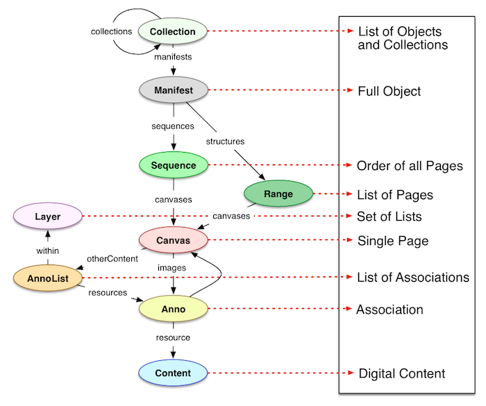

## EDN6103 - Web sémantique pour l'édition numérique

# Final
Emmanuel Château-Dutier et Antoine Fauchié, mars 2021

Site web pour les ressources du cours :  
[https://publicarchi.github.io/edn6103/](https://publicarchi.github.io/edn6103/)

===↓===

# Sommaire

## 1. Retour SPARQL

## 2. Applications

???

===→===

# 1. XXX

???

===↓===

eee

===→===

# 2. Applications

===↓===

définie par le W3C dans la perspective du Web sémantique ou Web de données (Open Linked Data). Ceci avec un double objectif :

- objectif de visibilité et d’accessibilité : rassemble des données issues de différentes bases de la Bnf
- objectif de diffusion : données ouvertes juridiquement avec licence libre et techniquement sous les formats du web sémantique

Pb spécifique des catalogues de la Bnf

- http://data.bnf.fr/semanticweb modèle qui s’inspire grandement de FRBR, pb éditions d’une même œuvre. exemple Voltaire, dictionnaire philo, etc. Retrouve aussi des liens vers d’autres documents, autres expression ou version de l’œuvre *Nicomède*.
- http://data.bnf.fr/opendata

Mise en œuvre qui suppose plusieurs choses. Importation de données en provenance de diverses bases ou sources de données dont importe des données structurées. Ces différentes sources sont soumises à des traitements automatisés pour les enrichir ou les regrouper. Ici utilisation de [CubicWeb](http://www.cubicweb.org/)

À l’issue de ce traitement, on obtient des données structurées pour les humains et dans des formats standards du web sémantique.

Pour y parvenir, utilisation des référentiels d’autorités. Utilisation d’identifiants uniques et de liens.

- des URI pour les ressources, actionnables et pérennes
- une exposition RDF en « Linked open data » pour les données de data.bnf.fr, disponible pour chaque page (par négociation de contenu) et pour toute la base
- un service SPARQL endpoint pour interroger les données

Données publiques sous licence libre pour permettre leur réutilisation par simple déclaration légère. Plusieurs possibilité de récupérations : par dump, par l’intermédiaire d’une API ou un SPARQL endpoint.

—> Susciter des réutilisations pour des usages nouveaux, échanger des données avec le monde de la recherche, le monde pédagogique ou du tourisme

—> Créer des liens et récupérer un certain nombre de ressources vers Wikipédia ou DBpédia pour fournir des vignettes ou biographies sur un auteur par exemple.

### OpenCat

Prototype développé dans le cadre d’un appel à projet innovant du MCC. Pour objectif de croiser les données de la Bnf, avec les données de la bibliothèque de Fresnes et des données extérieures.

Cette expérimentation de la BnF vise à encourager la réutilisation de ses données bibliographiques et d’autorité par les bibliothèques publiques, avec les outils du web de données, permettant d'enrichir les catalogues et d’offrir des nouveaux services. Le prototype réalisé sert de démonstrateur à des fins de recherche et de développement dans le contexte de coopérations nationales.

- évaluer catalogue au modèle FRBR
- récupération de données complémentaires (vignettes, ressources numériques, références extérieures complétant notices de catalogues publics)

[L'expérimentation OpenCat](http://www.bnf.fr/fr/professionnels/web_donnees_applications_bnf/a.opencat.html)

### Les identifiants : ISNI, ISSN et ARK

Si des identifiants de référence sont utilisés de manière conforme à leur usage dans de multiples bases de données distinctes, il devient aisé de relier ces données entre elles. A ce titre, les identifiants constituent un levier majeur du web de données.

[ISBN, ISSN, ISNI, ARK](http://www.bnf.fr/fr/professionnels/issn_isbn_autres_numeros.html)

### Objectifs (en 2015)

- Intégrer totalité des auteurs des catalogues
- reverser traitements automatiques dans le catalogue général et poursuivre sa FRBRisation
- poursuivre le travail de liens vers des sites extérieurs (Wikipédia, archives, musées)

Cf. https://youtu.be/lSdGiBBgp1I

---

## PIAAF (Pilote d’interopérabilité pour les autorités archivistiques françaises) 

<http://piaaf.demo.logilab.fr/>

Ontologie RiC-O (Records in Contexts - Ontology)

???

Ce mot pour dire que l’équipe projet PIAAF (Pilote d’interopérabilité pour les autorités archivistiques françaises) à récemment mis en ligne à l’adresse suivante :

un démonstrateur (preuve de concept) réalisé avec les technologies du web sémantique, pour démontrer qu’il est possible :

- de représenter en RDF, en veillant à la précision, à l’exactitude et à l’utilisabilité des triplets obtenus, des métadonnées archivistiques produites de différentes manières et selon diverses perspectives (données d’autorité encodées en fichiers XML/EAC-CPF et parties d’instruments de recherche en XML/EAD 2002) ;
- d’enrichir les triplets obtenus en créant de nouveaux triplets, qu’il s’agisse de procéder à des alignements ou d’établir de nouvelles relations par inférence ;
- de produire une interface de recherche et d’exploration analytique et graphique qui soit dynamique, ergonomique et signifiante, sans sacrifier la granularité informationnelle ni la lisibilité.

Ce projet expérimental a été réalisé par les Archives nationales, la Bibliothèque nationale de France, le Service interministériel des Archives de France au ministère de la Culture et la société Logilab. Les Archives nationales en ont assuré la direction.

Il a donc permis une première expérimentation qualitative de la sémantisation de métadonnées archivistiques réelles (fichiersEAC-CPF et parties d’instruments de recherche en EAD) selon le modèle
conceptuel RiC (Records in Contexts) et l’ontologie correspondante RiC-O (Records in Contexts - Ontology), en cours de construction au sein du Conseil international des archives. Les technologies du Web sémantique et de data visualisation ont été employées pour vérifier la faisabilité et l’utilité de la
transformation de ces fichiers en jeux de données, pour vérifier les gains en expressivité, les possibilités de construction de réseaux de relations, l’intérêt de l’interconnexion des données des trois partenaires institutionnels, l’utilité de leur visualisation en graphe.

Ses résultats ouvrent des perspectives intéressantes pour les institutions partenaires et pour toute entité ayant la responsabilité de documents d’archives et qui serait intéressée par l’emploi des technologies du web de données.

Les scripts et librairies développés dans le cadre du projet seront prochainement mis à disposition sous licence libre.

Le démonstrateur est un prototype, par définition imparfait.

En attendant le bilan détaillé du projet, il inclut des pages de présentation sur les enjeux et l’historique du projet, sur sa réalisation et sur le contenu du triplestore.
Vous y trouverez aussi un tutoriel (accessible en cliquant sur "Utiliser le prototype" en haut à droite).

Notez qu’il a été testé essentiellement avec des versions récentes de Firefox (>= 57) et Chrome (>= 60). 

Pour contacter l’équipe projet, vous pouvez utiliser l’adresse de messagerie ’[projet-piaaf.archives-nationales@culture.gouv.fr](mailto:projet-piaaf.archives-nationales@culture.gouv.fr)’

---

## Biblissima

http://beta.biblissima.fr

- http://doc.biblissima-condorcet.fr/vademecum-biblissima
- http://doc.biblissima-condorcet.fr/ontologie-biblissima
- http://data.biblissima.fr
- http://demos.biblissima-condorcet.fr/snorql/
- http://demos.biblissima-condorcet.fr/atelier-rdf-eusebe/
- http://demos.biblissima-condorcet.fr/florus/#rdf-florus

???

Bibliothèque virtuelle des bibliothèques, ce portail vous invite à découvrir l’histoire d’une partie des textes et livres qui ont été écrits, traduits, enluminés, collectionnés ou inventoriés depuis l’Antiquité jusqu’au XVIIIe siècle.

### Périmètre

Le portail Biblissima est destiné à constituer un point d’entrée de référence sur le patrimoine écrit du Moyen Age et de la Renaissance en Occident, du VIIIe au XVIIIe siècle.

Il propose un **accès unifié** à un ensemble de données numériques sur les manuscrits, incunables et imprimés anciens provenant des neuf équipes partenaires du consortium Biblissima. L’utilisateur peut notamment y consulter :

- des documents numérisés issus de Gallica (BnF), de la BVMM (IRHT-CNRS) et de nombreuses autres bibliothèques numériques à travers le monde grâce aux protocoles IIIF,
- des catalogues et bases de données spécialisées de diverses natures (provenances, iconographie, textes, reliures etc.),
- et, à terme, des éditions électroniques de textes (inventaires de bibliothèques anciennes, glose ordinaire de la Bible, sermons).

Diverses sources de données, utilisation d’un format pivot XML

## Fonctionnalités

Le portail est accessible à travers une interface web conviviale, facile d’utilisation et d’interrogation, intégrant trois fonctionnalités majeures : 

- **un moteur de recherche à facettes**, qui permet d’interroger les données et d’accéder à différents types de pages web reliées entre elles par des liens (manuscrit ou imprimé, lieu, personne ou collectivité, collection historique, oeuvre, inventaire, etc.). On peut ainsi, par rebonds successifs, suivre la transmission d’un texte, retracer l’histoire d’une bibliothèque ancienne...
- **des visualisations de données** : accès par cartes (lieux d’origine, vie d’un livre) et représentations en graphes (vie d’une oeuvre)
- **un visualiseur d’images (« Mirador »)**, capable d’afficher à distance les documents numérisés provenant de plusieurs bibliothèques numériques à travers le monde, et **conçu comme un véritable espace de travail autour des images**. A partir du portail, l’utilisateur peut ainsi constituer sa propre collection de documents, puis composer, sauvegarder et partager son environnement de visualisation personnalisé.

## Exposition des données

### Référentiels

Biblissima dispose de plusieurs **référentiels d’autorités** pour les différents types de données présentes dans le cluster : personnes, collectivités, établissements de conservation, œuvres, lieux. Ils sont pourvus d’identifiants stables, de formes préférentielles, de formes alternatives (graphies présentes dans les bases partenaires), des notes issues des bases partenaires ou du Catalogue général de la BnF et d’alignements vers des référentiels extérieurs.

Biblissima crée aussi un **référentiel de cotes de manuscrits et d’imprimés** (identifiant unique et stable, forme préférentielle), qui ont fait l’objet d’un travail de mise en correspondance et d’harmonisation afin de fusionner les données sur un même manuscrit ou imprimé ancien issues de différentes bases. 

Ces référentiels seront à terme disponibles sur le portail Biblissima.

### Web sémantique

Les données du cluster Biblissima seront exposées en **RDF**, sous la forme d’exports accessibles depuis les pages de chaque entité, de dumps et d’un triple store.

La structuration des données RDF sera conforme à [l’ontologie Biblissima](http://doc.biblissima-condorcet.fr/ontologie-biblissima) (basée sur le CIDOC CRM et FRBRoo).

### Web sémantique

Les données du cluster Biblissima seront exposées en **RDF**, sous la forme d’exports accessibles depuis les pages de chaque entité, de dumps et d’un triple store.

La structuration des données RDF sera conforme à [l’ontologie Biblissima](http://doc.biblissima-condorcet.fr/ontologie-biblissima) (basée sur le CIDOC CRM et FRBRoo).

http://beta.biblissima.fr/fr/a-propos

---

## International Image Interoperability Framework (IIIF)

http://iiif.io/

### Exemples

- http://doc.biblissima-condorcet.fr/introduction-iiif
- [Démo Mirador de Biblissima](http://demos.biblissima-condorcet.fr/mirador/)
- https://iiif.bodleian.ox.ac.uk
- http://projectmirador.org/

Pour en savoir plus https://kinow.github.io/scico-2017/#/

???

l’initiative internationale IIIF pour l’interopérabilité des images (International Image Interoperability Framework - IIIF).

L’espace de travail Mirador est un outil de visualisation et de manipulation d’images haute résolution, configurable et partageable selon les besoins de l’utilisateur. Il est possible d’y ajouter des documents à partir du portail en utilisant la fonction de "panier" (Ma sélection) accessible depuis les listes de résultats et la page d’un livre manuscrit ou imprimé. Une fois sa sélection de documents effectuée, l’utilisateur peut ouvrir les documents choisis dans Mirador, constituer son propre environnement de visualisation, puis enregistrer sa session et la partager par le biais d’un lien.

- Exemple de session : [beta.biblissima.fr/mirador?key=bMw0Db1d1YCE15Jox1xA&version=2](http://beta.biblissima.fr/mirador?key=bMw0Db1d1YCE15Jox1xA&version=2).
- [Démo Mirador de Biblissima](http://demos.biblissima-condorcet.fr/mirador/)

---

## API de présentation de IIIF

???

## API de présentation

> ### Structure
>
> The Presentation API describes “just enough metadata to drive a remote viewing experience”. This metadata is a **IIIF Manifest**. The Manifest represents the thing. A book. A painting. A film. A sculpture. An opera. A long-playing record. A manuscript. A map. An aural history field recording. A videocassette of a public information film. A laboratory notebook. A diary. All of these things would be represented by a IIIF Manifest. You publish IIIF manifests for each of your objects. 
>
> A manifest is what a IIIF viewer loads to display the object. A manifest could be used to generate a web page for the object. A manifest could be loaded into an annotation tool, or a IIIF editing environment to be used as source material in the creation of a new manifest.
>
> If the object the manifest represents is a photograph, there might only be one conceptually distinct view of it that we wish to convey via the Presentation API, to end up on a user's screen. For many objects there is more than one view. Even for a painting, it might be important to include the back of the canvas frame. And for books, manuscripts and much archive material, each page, leaf, folio or sheet is one or two separate views - in its normal state we can't look at all of them at once, the model conveys them as a sequence of distinct views. Depending on how the book has been captured and how we want to model it, we might have one view per page, or one view per double page spread, and extra views for inserts or supplementary material.
>
> cf. image
>
> ### Canvas pour les vues
>
> These views are represented by **Canvases**. A Manifest contains one or more **Sequences** of **Canvases**. A canvas is not the same as an image. The canvas is an abstraction, a virtual container for content. It's analogous to a PowerPoint slide; an initially empty container, onto which we "paint" content. If we want to provide a sequence of images to a book reading application, or for viewing paintings, the concept of a canvas may seem like an extra layer of complexity. It's not much more complicated to do it this way, but it is much more flexible and powerful.
>
> *The canvas is the abstract space; we provide an image to paint the canvas*
>
> The Canvas keeps the content separate from the conceptual model of the page of the book, or the painting, or the movie. The content can be images, blocks of text, video, links to other resources, and the content can be positioned precisely on the canvas. By including a Canvas in a Manifest, you provide a space on which you and others can **annotate** content. For image-based content the PowerPoint analogy is clear: the Canvas is a 2D rectangular space with an aspect ratio. The height and width properties of a canvas define the aspect ratio and provide a simple coordinate space. This coordinate space allows the creator of the manifest to associate whole or parts of content with whole or parts of canvases, and for anyone else to make their own annotations in that space.
>
> This means that you can provide more than one representation of a view. You might have a painting photographed in natural light and in X-ray. You might have a manuscript that was captured to microfilm, and your initial presentation of the material uses images derived from the microfilm. Later, you go back and photograph some of the folios at high resolution, maybe those with illuminations. You can update the content associated with a Canvas without having to retract the canvas and the other content you might already have associated with it.
>
> You may have a manuscript represented as a sequence of Canvases, but for some of those Canvases you have no image at all - the page was known to exist, but is now lost. You may still have text content associated with the Canvas - transcriptions from a copy, commentary, or other notes. The fact that for this particular folio you have no photographic representation doesn't stop you modelling it in the Manifest and associating content with it - just not an image in this case.
>
> ### Annotation
>
> All association of content with a canvas is done by **annotation**. The IIIF Presentation API is built on the Open Annotation standard, which has now become the W3C Web Annotation Data Model. At its simplest, the Web Annotation Data Model is a formalised way of linking resources together:
>
> *An annotation is considered to be a set of connected resources, typically including a body and target, and conveys that the body is related to the target. The exact nature of this relationship changes according to the intention of the annotation, but the body is most frequently somehow "about" the target. This perspective results in a basic model with three parts, depicted below. The full model supports additional functionality, enabling content to be embedded within the annotation, selecting arbitrary segments of resources, choosing the appropriate representation of a resource and providing styling hints to help clients render the annotation appropriately.*
>
> A simple annotation might be an association between a page of a manuscript and an article about that page elsewhere on the web. Or, in the context of a bookreader or viewer, it might be a comment on or transcription of a particular part of the page, or the whole page. This notion of annotations as commentary or transcriptions is familiar:
>
> But in IIIF, the image itself is one just of the pieces of content annotating the abstract canvas. There may be multiple images, there may be no images at all. This diagram shows that all the content a user ever sees rendered by a viewer - images, text and other content - is associated with the virtual space of the canvas via the mechanism of annotation.
>
> source https://resources.digirati.com/iiif/an-introduction-to-iiif/

Shared Canvas, espace abstrait utilisé pour construire une vue de l’objet (cf. diapositives powerpoint)

### Properties

- Descriptive

  - `label`, nom de la ressource

  - `description`, résumé textuel

  - `thumbnail`, aperçu visuel

  - `metadata`, paires noms-valeurs

    ex: label:"Creates", value:"1300"

- Rights

  - `licence`, lien vers la description de la licence
  - `attribution`, texte à affiche
  - `logo`, image à présenter

- Linking

  - `service`, point d’entrée du service additionnel
  - `sseAlso`, ressource de métadonnées
  - `related`, resource à présenter aux utilisateurs

Voir aussi 

- https://www.slideshare.net/azaroth42/iiif-presentation-api
- https://resources.digirati.com/iiif/an-introduction-to-iiif/ +++
- https://youtu.be/EE1YskDrzPs

---

## Pundit

http://thepund.it

- [exemple d’utilisation](http://net7.github.io/pundit2/)

### Recommandations du Web Annotation Working Group du W3C 

- [Web annotation Data Model](https://www.w3.org/TR/annotation-model/), 
- [Web Annotation Vocabulary](https://www.w3.org/TR/annotation-vocab/), 
- [[Web Annotation Protocol](https://www.w3.org/TR/annotation-protocol/)

### Autre implémentations

- [Hypothes.is](https://hypothes.is) (libre et open source)

---

## ResearchSpace

The British Museum

https://www.researchspace.org

???

The British Museum

Dominic Oldman

> The ResearchSpace project emerged from an idea for a shared digital research infrastructure proposed by the Andrew W. Mellon Foundation. The vision was to enable projects to address different research questions, employing a range of investigative methods, tools and visualisations, while supporting collaboration and knowledge sharing across projects and institutions. This flexible, shared platform would reduce project costs, use innovative digital methods, and focus more resources for research.
>
> https://www.britishmuseum.org/research/research_projects/all_current_projects/researchspace.aspx

https://github.com/researchspace/researchspace

---

## BBC

https://www.bbc.co.uk/academy/en/articles/art20130724121658626

## New York Times (hs)

http://data.nytimes.com 2009

https://open.nytimes.com

https://sites.google.com/site/nytimeslinkeddata/analysis

---

## Semantic MediaWiki

http://www.aifb.kit.edu/web/Semantic_MediaWiki_Software/en

http://publicartmuseum.net

???

Semantic MediaWiki (2005),

> Semantic MediaWiki (SMW) is an open-source project to which many people and organisations have contributed. The SMW project was founded by Markus Krötzsch and Denny Vrandecic during their work at the Institute AIFB at Karlsruhe Institute of Technology (KIT). There is an active developer and user community with yearly conferences (SMWCon) in Europe and America. People at AIFB are involved in SMW in various projects. Also, AIFB organises a yearly SMW-Seminar. Various extensions to SMW have been developed by AIFB employees. For instance, the Semantic Web Browser and Semantic Project Management.

---

## OmekaS

https://github.com/omeka/omeka-s

???

Plate-forme de publication Web dédiées aux collections numériques du patrimoine culturel) sort de sa version bêta et maintenant disponible en v1 stabilisée.

---

## Arches

https://www.archesproject.org

> Arches is an open source software platform freely available for cultural heritage organizations to independently deploy to help manage their cultural heritage data.

---

### OpenRefine

https://github.com/OpenRefine/OpenRefine/releases/tag/2.8

### Tag

<http://tag.ontotext.com/>

### Karma, a Data Integration Tool

http://usc-isi-i2.github.io/karma/

???

### OpenRefine

https://github.com/OpenRefine/OpenRefine/releases/tag/2.8

### Tag

<http://tag.ontotext.com/>

pour nettoyer et enrichir des jeux de données) sort sa version 2.8 (après 2–3 ans sans nouvelle version stabilisée)

Outil “**tag**” de l’entreprise ontotext permettant de faire de l’extraction d’entités nommées via #DBpédia et#wikidata

### Karma, a Data Integration Tool

http://usc-isi-i2.github.io/karma/

---

## Sourcera

https://www.zenlan.com/addons/

add-on pour chercher dans des archives à travers le monde des images réutilisables d’un seul clic à ajouter à un document ou une diapositive Google

[Culture collage](https://www.zenlan.com/collage/) (projet original)

---

## Crotos

http://zone47.com/crotos

---

## Mondeca Labs

http://labs.mondeca.com

## Datalift

https://datalift.org

---

## Proto Canada

http://chin-rcip.canadiana.ca/aclod/?lang=fr

http://www.canadiana.ca/rpcpd-dol

## Gouvernance politique sur le territoire du Québec de 1612 à aujourd’hui

Prototype du [Lab du Répertoire du patrimoine culturel du Québec](http://www.patrimoine-culturel.gouv.qc.ca/lab), 2017-2018

http://culturenumerique.mcc.gouv.qc.ca/2018-06-26-web-semantique-un-premier-prototype/

???

Plutôt que de partager seulement l’information sur le modèle de données et le graphique illustrant les correspondances que nous avons établies entre les champs actuels de la base de données Artefacts Canada et les énoncés en RDF, j’ai choisi de partager avec vous l’ensemble du rapport de projet qui décrit ce que nous avons fait, présente le modèle de données et identifie les ontologies utilisées. Malheureusement, la version française n’est pas disponible pour le moment, mais entretemps je vous l’expédie dans sa version originale anglaise. Si vous avez des questions, vous pouvez communiquer avec moi et je tenterai d’apporter des éclaircissements au besoin. 

Je rappelle que ce modèle correspond à un travail préliminaire effectué pour notre projet de démonstration, pour des collections d’art canadien uniquement, sur un sous-ensemble d’un peu moins de 87 000 fiches descriptives d’œuvres provenant de 8 musées canadiens ayant participé au projet. Puisque ce projet a démontré la faisabilité d’utiliser des technologies offertes présentement et d’adopter un modèle viable, nous amorçons présentement la planification du travail par phases successives qui nous permettra d’intégrer des données pour les autres disciplines des sciences humaines (archéologie, ethnologie/histoire…), de modifier et d’étendre notre modèle de données en conséquence, ainsi que le choix de nouvelles ontologies et autorités.

https://app.pch.gc.ca/sgc-cms/nouvelles-news/anglais-english/?p=10218

Prix en 2016 pour innovation, The Innovation Award at Canadian Heritage

en lien avec [New Plan on Open Government 2016-2018](http://open.canada.ca/en/consultations/canadas-new-plan-open-government-2016-2018#toc5-1-8)

---

## Survey of GLAM open access policy and practice [2.0]

<https://docs.google.com/spreadsheets/d/1WPS-KJptUJ-o8SXtg00llcxq0IKJu8eO6Ege_GrLaNc/edit#gid=1216556120>

---

## Bonnes pratiques

### Data on the Web Best Practices

W3C Recommendation 31 January 2017, 
https://www.w3.org/TR/dwbp/

### Data on the Web Best Practices: Data Quality Vocabulary

W3C Working Group Note 15 December 2016, 
https://www.w3.org/TR/vocab-dqv/

### Linked Data Platform Best Practices and Guidelines

W3C Working Group Note 28 August 2014,
https://www.w3.org/TR/ldp-bp/

---

class: inverse, center, middle

# Conclusion

???

Cours seulement une rapide introduction aux technologies du web sémantique et du Linked Open Data. Normalement vous devriez maintenant être en mieux en mesure de comprendre de quoi il s’agit.

Un prolongement du web pour mettre à disposition des données structurées compréhensibles par les machines. Autrement dit, une autre manière d’utiliser le web, ou une extension du web. Avec le web sémantique, on passe d’un web de documents à un web de données.

Nombreuses applications possibles :

- agrégation de données hétérogènes
- publication de données
- enrichissements de données

Mentionner schéma.org

Qui doit faire les requêtes ?

- une forte dimension contenu
- pas facile de trouver des développeurs compétents

Peut-être vous ?

Un domaine particulièrement actif dans le secteur culturel —> Idée de pouvoir imaginer des utilisation possible dans le secteur de l’édition.

---

# Biblio et références

http://www.iro.umontreal.ca/~lapalme/ift6282/SparqlSyntaxe.html

http://www.iro.umontreal.ca/~lapalme/ift6282/SparqlRappels.html

## Blogs

https://bibliotheques.wordpress.com

## À voir 

http://aksw.org/Projects/CubeViz.html

wtf https://ruben.verborgh.org/publications/

exemple https://wragge.github.io/lodbook-james-minahan/

## À ajouter HA

http://linked.art/index.html

https://github.com/NatLibFi/Skosmos

https://github.com/geoTirroirs

Ontologie Vivo pour décrire structures de recherche http://www.vivoweb.org

http://www.sparontologies.net

https://getfedora.org/fr/

INIST https://www.loterre.fr

http://whgazetteer.org

https://www.glam.ox.ac.uk/oxford-linked-open-data-pilot

http://blog.antidot.net/2011/12/19/decouvrez-les-monuments-historiques-grace-a-lopen-data/comment-page-1/

http://labs.antidot.net

V1 http://labs.antidot.net/search?afs:service=50005&afs:output=xsl

Doremus DOing REusable MUSical data http://www.doremus.org

https://linkedpipes.com

https://linkedjazz.org/ migre vers Wikidata

https://github.com/semantalytics/awesome-semantic-web

===↓===

## Discussion

### **Quelles opportunités pour le domaine éditorial ?**

--

- Quelles conséquences sur le format livre ?

--

- Quelles sources de données pourraient être utiles ?

--

- Quels types d’applications possibles ?

===↓===

## Biblio

- Bermès, Emmanuelle dir. (2013). *Le Web sémantique en bibliothèque*. « Bibliothèques ». Paris : Édition du Cercle de la Librairie. ISBN 9782765414179
- Eero Hyvönen (2012). *Publishing and Using Cultural Heritage Linked Data on the Semantic Web.* Synthesis Lectures on semantic web : Theory and technology. Morgan & Claypool publishers. ISBN 1608459985
- Van Holland Seth, Ruben Verborgh (2014). *Linked Data for Libraries, Archives and Museums, How to clean, link and publish your metadata.* Facet publishing. ISBN 9781783300389
- Juanals, Brigitte et Jean-Luc Minel. 2016. La construction d’un espace patrimonial partagé dans le Web de données ouvert.* Communication* 34 n° 1 p. doi :10.4000/communication.6650. https://communication.revues.org/6650.
- Doerr, Martin. (2009). Ontologies for Cultural Heritage. *Handbook on Ontologies.* p. 463-486. DOI : 10.1007/978-3-540-92673-3
- Schafer, Valérie éd. (2016). *Histories of the Internet and the Web.*. Dirigé par Alexandre Serres. Living books about history. http://www.livingbooksabouthistory.ch/en/book/histories-of-the-internet-and-the-web
- Chignard, Simon (2012). L’open data: comprendre l’ouverture des données publiques. Limoges : Fyp. Entreprendre. ISBN 9782916571706.

===↓===

## Pour aller plus loin

- Allemang, Dean et Jim Hendler. *Semantic Web for the Working Ontologist. Effective modeling in RDFS and OWL.* 2e éd. Morgan Kaufmann, 2011. ISBN-10: 0123859654 http://www.workingontologist.org
- DuCharme Bob. *Learning SPARQL: Querying and Updating with SPARQL 1.1.* 2e éd. O’Reilly, 2013. ISBN-10: 1449371434
- Gandon, Fabien (2012). Le web sémantique: comment lier les données et les schémas sur le web. Paris : Dunod. InfoPro. Management des systèmes d’information. ISBN 9782100572946.
- Yu, Liyang. *A Developer’s Guide to the Semantic Web.* 2e éd. Springer. 2014. ISBN-10: 3662437953.
- Hitzler, Pascal, Markus Krötzsch, Sebastian Rudolph. *Foundations of Semantic Web Technologies.* CRC Press. 2009. ISBN-10: 142009050X

===↓===

## Lectures muséo

- Juanals, Brigitte et Jean-Luc Minel. « La construction d’un espace patrimonial partagé dans le Web de données ouvert. » Communication vol. 34 n° 1. doi :10.4000/communication.6650. <https://communication.revues.org/6650>
- Szekely, Pedro, Craig A. Knoblock, Fengyu Yang, Eleanor E. Fink, Shubham Gupta, Rachel Allen, et Georgina Goodlander. Publishing the Data of the Smithsonian American Art Museum to the Linked Data Cloud. International Journal of Humanities and Arts Computing.vol. 8 n° supplement, 2014. 152-166. <https://doi.org/10.3366/ijhac.2014.0104>

===↓===

## WTF sur Tweeter

- Antoine Isaac (Europeana, Europe) @antoine_isaac
- Patrick Murray-John @patrick_mj
- Antoine Courtin @seeksanusername
- Josée Plamondon @joplam
- ICOM.CIDOC @icomCIDOC
